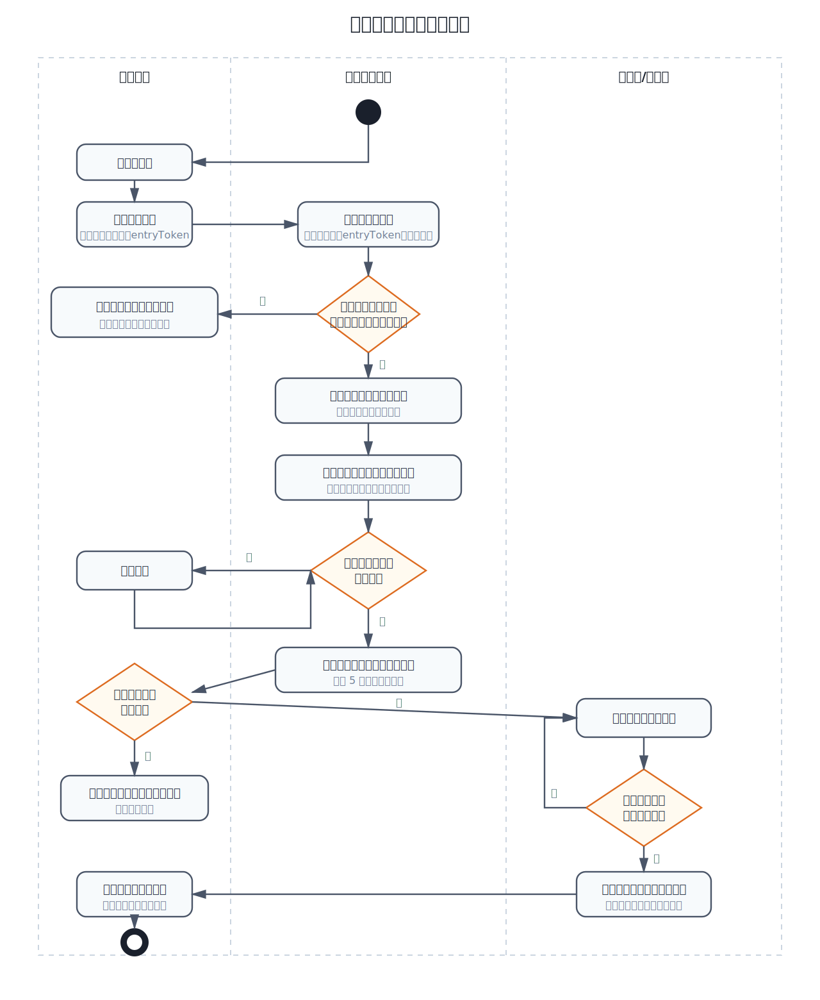
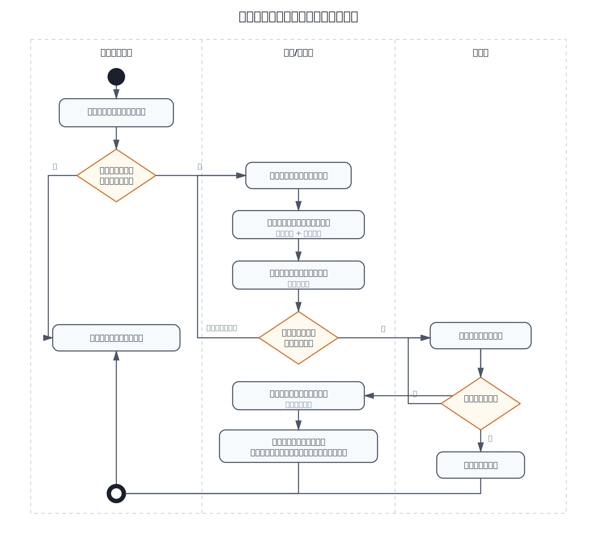
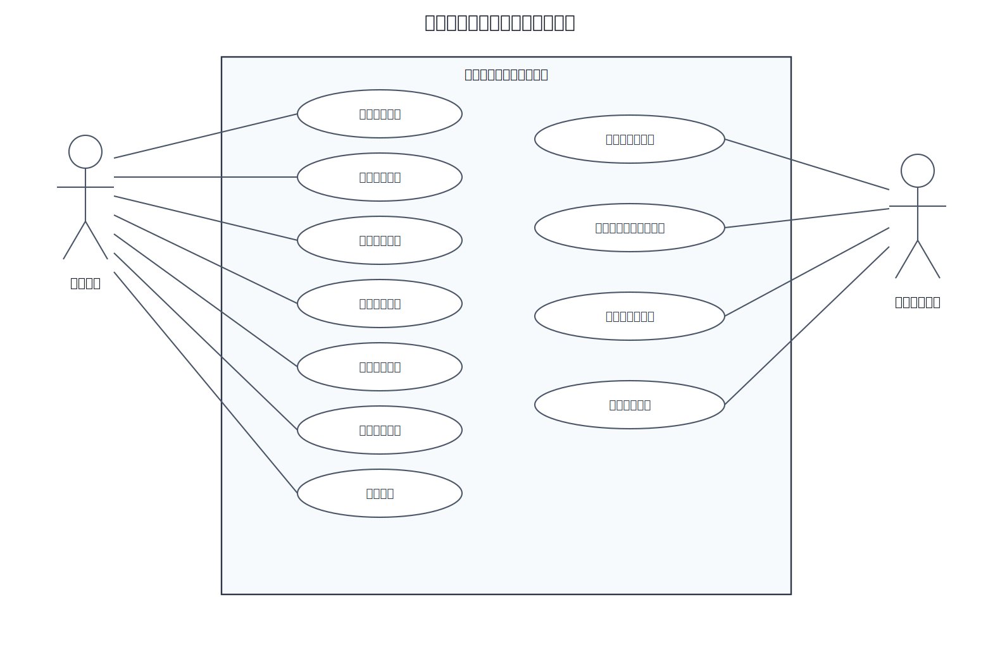
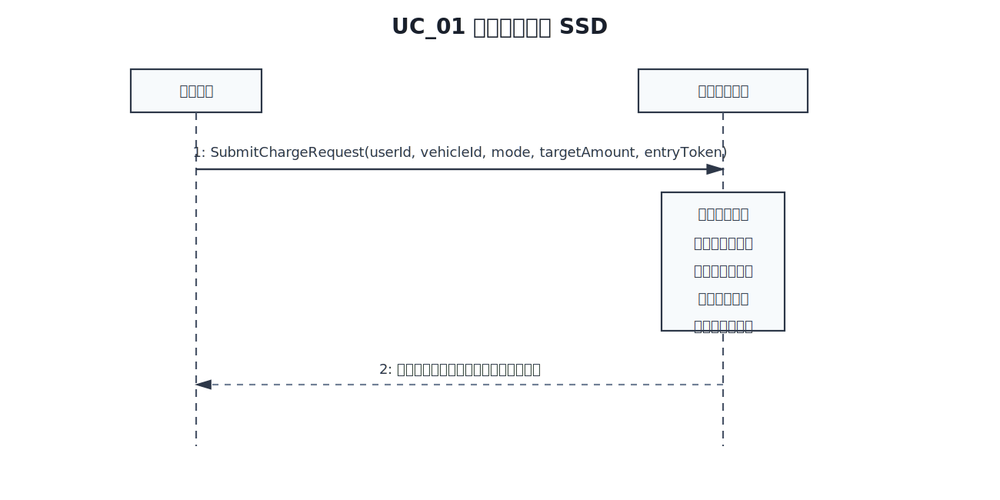
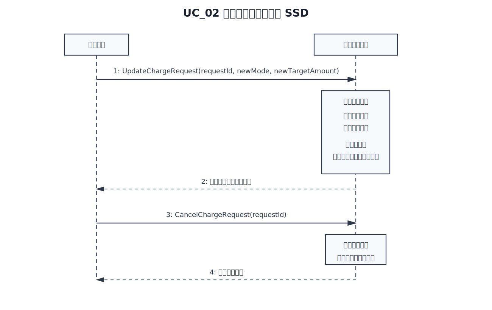
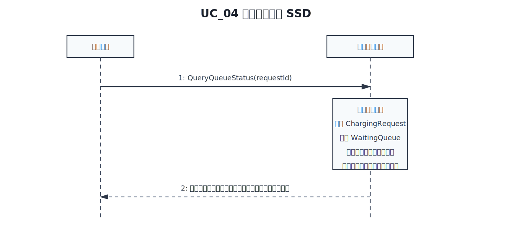
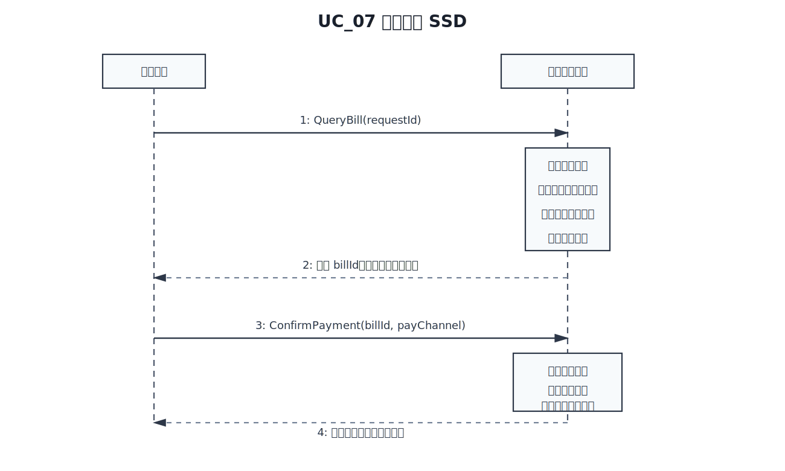
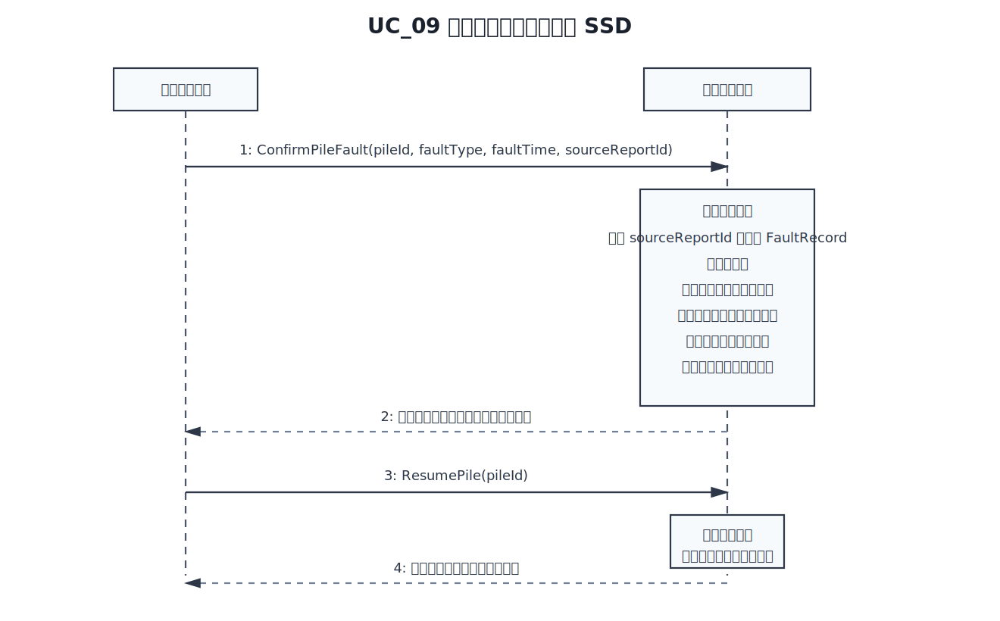

---
typora-root-url: ./
---

# 智能充电桩调度计费系统_领域模型及用例模型

> 组长：唐振桓  
> 组员1：杨凌俊  
> 组员2：袁炜途  
> 组员3：马迪轩  
> 组员4：刘宇轩  
> 日期：2026/04/10

## 目录

- [智能充电桩调度计费系统\_领域模型及用例模型](#智能充电桩调度计费系统_领域模型及用例模型)
  - [目录](#目录)
- [第一章：系统背景](#第一章系统背景)
  - [当前系统的核心业务介绍](#当前系统的核心业务介绍)
  - [当前系统的业务流程](#当前系统的业务流程)
    - [客户使用充电服务的流程](#客户使用充电服务的流程)
    - [充电站后台调度与故障重调度流程](#充电站后台调度与故障重调度流程)
  - [领域模型](#领域模型)
- [第二章：用例模型](#第二章用例模型)
  - [用例图](#用例图)
    - [识别角色](#识别角色)
    - [识别用例](#识别用例)
    - [用例图](#用例图-1)
  - [系统顺序图及操作契约](#系统顺序图及操作契约)
    - [UC\_01 提交充电请求](#uc_01-提交充电请求)
    - [UC\_02、UC\_03 修改或取消充电请求](#uc_02uc_03-修改或取消充电请求)
    - [UC\_04 查看排队状态](#uc_04-查看排队状态)
    - [UC\_05 响应叫号通知](#uc_05-响应叫号通知)
    - [UC\_06 上报设备异常](#uc_06-上报设备异常)
    - [UC\_07 完成支付](#uc_07-完成支付)
    - [UC\_08 查看充电桩状态](#uc_08-查看充电桩状态)
    - [UC\_09、UC\_10 确认并处理充电桩故障](#uc_09uc_10-确认并处理充电桩故障)
    - [UC\_11 查看运营报表](#uc_11-查看运营报表)
- [工作量统计](#工作量统计)
  - [评分项分工表](#评分项分工表)
  - [细化分工表](#细化分工表)

# 第一章：系统背景

## 当前系统的核心业务介绍

波普特大学智能充电桩调度计费系统面向校内电动汽车用户与充电站管理员，核心目标是在满足公平排队、分时计费、设备容量有限和故障可恢复等约束下，使用户完成一次充电服务的总耗时尽可能短，并保证管理端能够持续掌握充电站运行状态。

当前业务围绕“申请充电、排队调度、执行充电、计费结算、故障处理、报表管理”六类核心活动展开：

1. 用户驾驶车辆进入等候区后，通过客户端提交充电请求，给出充电模式（快充/慢充）与目标充电量。系统在受理前需要验证该用户当前具备等候区服务资格，但不要求上传连续物理坐标，实际建模中可抽象为等候区入场凭证、现场终端会话或 `entryToken`。
2. 系统对请求进行校验后，将其放入对应模式的等候队列，并持续进行排队位置检测、越序校验和预计等待时间计算，防止未轮到的车辆提前占用充电资源。
3. 当充电区存在可用车位时，系统从对应队列中选择合适车辆进入充电区，并依据“完成服务总时间最短”的规则分配具体充电桩及桩内排队位置。
4. 系统叫号后，用户必须在限定时间内响应并进入充电区；本方案规定确认入场超时时间为 5 分钟，超时未入场视为爽约，系统自动取消本次请求并释放预留资源。
5. 用户在排队阶段可以修改目标电量，也可以取消请求；若用户重新选择充电模式，则为保证公平性，系统按照“取消原请求并重新提交新请求”的业务规则处理，而不采用原队列原地换模式的方式。
6. 用户在提交请求后可以暂时离开办理其他事务，系统不管理用户个人去向，但需要持续维护其请求状态、排队顺序和叫号通知；若车辆实际离开等候区或用户无法按时响应叫号，则按取消或超时取消处理。
7. 车辆开始充电后，系统持续记录会话信息、充电电量、开始与结束时刻；当本次充电完成时，系统立即释放充电桩资源，并基于已充电量生成账单。支付可以延后完成，但未支付账单的用户将被限制再次发起新的充电请求。
8. 用户可以上报“设备异常”或“疑似故障”，但这类上报不会直接改变充电桩状态；只有管理员确认后，系统才会将充电桩状态更新为故障并触发正式重调度。
9. 当充电桩发生故障时，系统会立即停止故障桩的继续计量，保存已完成充电量与已发生费用，将当前会话标记为“故障中断”；随后针对剩余待充电量生成新的重调度请求，并在同模式队列中保留原始排队优先信息后重新调度。

从业务边界看，本系统由服务器端、用户客户端和管理员客户端共同组成：

1. 服务器端负责排队、调度、计费、超时控制、账单生成、黑名单/欠费限制与报表汇总。
2. 用户客户端负责提交请求、查看状态、修改请求、取消请求、响应叫号、上报设备异常和完成支付。
3. 管理员客户端负责查看充电桩状态、确认故障、处理故障、恢复设备和查看运营报表。

因此，本系统本质上是一个“以排队调度为核心、以分时计费为约束、以超时控制、欠费限制和故障恢复为保障、以用户时效体验为目标”的充电服务管理系统。

## 当前系统的业务流程

下面按照模板要求，使用 UML 活动图描述当前系统的关键业务流程。

### 客户使用充电服务的流程

该流程覆盖用户从进入等候区、发起充电请求、等待系统调度、接受排队位置检测、接收叫号通知、进入充电区、开始充电、结束充电到完成支付的完整业务闭环。流程中补充了四项关键规则：

1. 对未轮到却尝试进入充电区的情况，系统执行排队位置检测和越序校验，不允许插队。
2. 对已叫号但用户迟迟不进入充电区的情况，系统执行 5 分钟超时取消规则。
3. 对存在逾期未支付账单的用户，系统在受理阶段直接拒绝其再次发起充电服务。
4. 对充电完成后的资源释放，系统在结束充电时立即释放充电桩，而不是等待支付后再释放。

对于“用户提交请求后出去做别的事”的场景，系统不管理用户个人活动轨迹，只管理该用户对应请求是否有效、是否仍在队列中以及是否按时响应叫号通知。

### 充电站后台调度与故障重调度流程

该流程补充说明后台在“有空闲车位”和“充电桩故障”两类典型场景下的系统处理步骤，重点体现队列调入、桩分配、故障隔离、会话中断处理、受影响车辆回退和再调度机制。

## 领域模型

结合系统业务需求与功能边界，本系统识别出以下 18 个核心领域类：充电站、等候区、充电区、充电桩、快充桩、慢充桩、等待队列、充电用户、车辆、充电请求、充电会话、账单、分时电价规则、服务费规则、异常上报、故障记录、管理员、日报表。

在给出 UML 类图之前，现将主要概念类之间的逻辑关系及 UML 建模表达说明如下：

- 1.场地空间与组合关系：
	- 充电站与其内部的等候区、充电区为“整体-局部”的组合关系 (Composition)，表示物理上的强包含。
	- 等候区通过聚合关系 (Aggregation) 容纳 2 个等待队列（快充/慢充）；充电区则聚合了多个充电桩。
	
- 2.设备分类与继承关系：
	- 快充桩与慢充桩是充电桩的特殊化表现，三者构成继承关系 (Generalization)，共同拥有充电桩的基础属性与状态。
	
- 3.用户、车辆与请求关联：
	- 一个充电用户可拥有多辆车辆，但同一时刻一辆车仅能发起一个有效的充电请求。
	- 充电请求在未进入充电区前，归属于特定的等待队列；在调度成功后，关联到具体的执行充电桩。
	
- 4.执行会话与计费结算：
	- 充电请求正式执行时生成充电会话，并实时记录充电数据。
	- 会话结束产生账单，账单在计算金额时需强制引用当前的分时电价规则与服务费规则，以体现价格随时间波动的需求。
	
- 5.异常维护与管理逻辑：
	- 充电用户发现设备问题可提交异常上报并指向特定充电桩。
	- 管理员监控充电桩状态，并在核实异常后生成故障记录（故障记录可引用用户的异常上报作为来源）。
	- 管理员负责处理故障并定期查阅由系统汇总生成的日报表。
	
	

下面是详细UML类图

# 第二章：用例模型

## 用例图

### 识别角色

结合系统边界和业务职责，识别出以下角色：

| 角色名称 | 角色说明 | 与系统的关系 |
| --- | --- | --- |
| 充电用户 | 在等候区提交请求、查看排队、修改/取消请求、响应叫号、上报设备异常、完成支付的校内车主 | 通过用户客户端直接使用系统服务，是主要业务发起者 |
| 充电站管理员 | 监控设备运行状态、确认并处理充电桩故障、查看报表、维护设备可用性的工作人员 | 通过管理员客户端维护系统正常运行，是管理类业务发起者 |

### 识别用例

根据角色与系统的交互场景，识别出以下主要用例。

| 用例编号 | 用例名称 | 主要参与者 | 简要说明 |
| --- | --- | --- | --- |
| UC_01 | 提交充电请求 | 充电用户 | 用户提交充电模式与目标电量，系统验证其具有等候区服务资格且不存在逾期未支付账单后建立有效请求并进入对应等待队列 |
| UC_02 | 修改充电请求 | 充电用户 | 用户在未开始充电前调整请求；若仅变更电量则原请求更新，若变更模式则按取消原请求并重新提交新请求处理 |
| UC_03 | 取消充电请求 | 充电用户 | 用户在排队阶段主动放弃服务，系统释放队列名额 |
| UC_04 | 查看排队状态 | 充电用户 | 用户查询当前排队号码、预计等待时长和被分配的充电桩 |
| UC_05 | 响应叫号通知 | 充电用户 | 用户在规定时间内确认入场并进入充电区；超时未响应则系统自动取消 |
| UC_06 | 上报设备异常 | 充电用户 | 用户发现异常后提交异常反馈，供管理员确认；该反馈本身不直接改变设备状态 |
| UC_07 | 完成支付 | 充电用户 | 用户对已结束的充电会话账单进行确认和支付 |
| UC_08 | 查看充电桩状态 | 充电站管理员 | 管理员查看各充电桩的可用、占用、排队和故障状态 |
| UC_09 | 确认并处理充电桩故障 | 充电站管理员 | 管理员对异常进行确认、登记故障、停用设备并触发再调度 |
| UC_10 | 恢复充电桩服务 | 充电站管理员 | 管理员完成维修后恢复设备可用状态 |
| UC_11 | 查看运营报表 | 充电站管理员 | 管理员查看站点收费、服务次数、故障次数等汇总数据 |

### 用例图

系统级完整用例图如下：

## 系统顺序图及操作契约

以下内容选择最能体现系统核心能力的十一个用例，分别给出 SSD（System Sequence Diagram）及操作契约。消息均采用可编码的英文命名方式，并给出参数列表。

### UC_01 提交充电请求

1. SSD（系统顺序图）

对应的可编程名称如下：

| 消息中文名 | 消息可编程名称 | 参数列表（P1,P2,...Pn） |
| --- | --- | --- |
| 提交充电请求 | `SubmitChargeRequest` | `userId, vehicleId, mode, targetAmount, entryToken` |

2. 操作契约

| 项目 | 内容 |
| --- | --- |
| 系统事件 | `SubmitChargeRequest(userId, vehicleId, mode, targetAmount, entryToken)` |
| 交叉引用 | UC_01 提交充电请求 |
| 前置条件 | 1. 用户已进入等候区。 2. 用户和车辆身份有效。 3. `entryToken` 可证明用户具备等候区服务资格。 4. 当前不存在该车辆未完成的有效充电请求。 5. 用户不存在未支付且已超期的账单限制。 |
| 后置条件 | 1. 创建一个新的 `ChargingRequest` 对象。 2. `ChargingRequest` 与 `User`、`Vehicle` 建立关联。 3. 系统根据 `mode` 将请求加入对应 `WaitingQueue`。 4. 初始化请求状态为“排队中”，记录申请时间、目标电量、请求编号。 5. 更新等待队列长度与预计等待时长。 6. 向用户返回受理结果与排队信息。 |

说明：`QueryQueueStatus` 不属于“提交充电请求”用例的系统事件，而属于“查看排队状态”用例。

### UC_02、UC_03 修改或取消充电请求

1. SSD（系统顺序图）

消息对应表如下：

| 消息中文名 | 消息可编程名称 | 参数列表（P1,P2,...Pn） |
| --- | --- | --- |
| 修改充电请求 | `UpdateChargeRequest` | `requestId, newMode, newTargetAmount` |
| 取消充电请求 | `CancelChargeRequest` | `requestId` |

2. 操作契约

| 项目 | 内容 |
| --- | --- |
| 系统事件 | `UpdateChargeRequest(requestId, newMode, newTargetAmount)` |
| 交叉引用 | UC_02 修改充电请求 |
| 前置条件 | 1. 对应 `ChargingRequest` 存在。 2. 请求状态仍为“排队中”或“已调度未开始充电”。 3. 新参数满足系统业务规则。 |
| 后置条件 | 1. 若仅修改目标电量，则更新原 `ChargingRequest` 的目标电量和预计等待信息。 2. 若修改充电模式，则原请求被标记为取消，并创建一个新的 `ChargingRequest` 对象重新进入新模式等待队列。 3. 清除原调度结果并重新计算预计等待时长。 4. 更新请求修改时间和当前排队位置。 5. 向用户返回修改后的排队信息。 |

| 项目 | 内容 |
| --- | --- |
| 系统事件 | `CancelChargeRequest(requestId)` |
| 交叉引用 | UC_03 取消充电请求 |
| 前置条件 | 1. 对应 `ChargingRequest` 存在。 2. 请求尚未进入正在充电状态。 |
| 后置条件 | 1. 将 `ChargingRequest` 状态改为“已取消”。 2. 请求从等待队列或充电桩排队队列中移除。 3. 若已预留充电区车位，则释放对应资源。 4. 更新相关队列长度和后续车辆的预计等待时间。 5. 向用户返回取消成功结果。 |

### UC_04 查看排队状态

1. SSD（系统顺序图）

消息对应表如下：

| 消息中文名 | 消息可编程名称 | 参数列表（P1,P2,...Pn） |
| --- | --- | --- |
| 查看排队状态 | `QueryQueueStatus` | `requestId` |

2. 操作契约

| 项目 | 内容 |
| --- | --- |
| 系统事件 | `QueryQueueStatus(requestId)` |
| 交叉引用 | UC_04 查看排队状态 |
| 前置条件 | 1. 对应 `ChargingRequest` 存在。 2. 请求状态为“排队中”或“已调度未开始充电”。 3. 当前用户对该请求具有查询权限。 |
| 后置条件 | 1. 读取 `ChargingRequest` 当前状态、所属 `WaitingQueue`、当前排队位置和预计等待时间。 2. 若系统已完成桩分配，则返回预分配的 `ChargingPile` 与桩内排队位置。 3. 不修改任何持久化业务对象，仅返回最新队列视图。 |

说明：`QueryQueueStatus` 在业务上是独立于 `SubmitChargeRequest` 的持续性查询行为。

### UC_05 响应叫号通知

1.SSD（系统顺序图）

| 消息中文名   | 消息可编程名称 | 参数列表（P1,P2,...Pn） |
| ------------ | -------------- | ----------------------- |
| 响应叫号通知 | `ConfirmEntry` | `requestId`             |

2.操作契约

| 项目     | 内容                                                         |
| -------- | ------------------------------------------------------------ |
| 系统事件 | `ConfirmEntry(requestId)`                                    |
| 交叉引用 | UC_05 响应叫号通知                                           |
| 前置条件 | 1. 对应 `ChargingRequest` 存在。2. 系统已向该请求发出叫号通知。3. 请求状态为“已调度未开始充电”。4. 当前时间未超过系统规定的响应时间（5分钟）。 |
| 后置条件 | 1. 将 `ChargingRequest` 状态更新为“已确认入场”。2. 记录用户确认时间。3. 锁定系统为该请求分配的 `ChargingPile`。4. 更新充电区资源占用状态。5. 向用户返回确认成功结果以及对应充电桩信息。 |

### UC_06 上报设备异常

1.SSD（系统顺序图）

| 消息中文名   | 消息可编程名称         | 参数列表（P1,P2,...Pn）       |
| ------------ | ---------------------- | ----------------------------- |
| 上报设备异常 | `ReportDeviceAbnormal` | `userId, pileId, description` |

2.操作契约

| 项目     | 内容                                                         |
| -------- | ------------------------------------------------------------ |
| 系统事件 | `ReportDeviceAbnormal(userId, pileId, description)`          |
| 交叉引用 | UC_06 上报设备异常                                           |
| 前置条件 | 1. 用户身份有效。2. `ChargingPile` 存在。3. 用户当前处于充电过程或正在使用该设备。 |
| 后置条件 | 1. 创建一个新的 `AbnormalReport` 对象。2. 记录异常描述、上报时间、用户信息及对应充电桩。3. 将异常记录与对应 `ChargingPile` 建立关联。4. 通知管理员客户端存在新的异常上报。5. 向用户返回上报成功结果。 |

### UC_07 完成支付

1. SSD（系统顺序图）

消息对应表如下：

| 消息中文名 | 消息可编程名称 | 参数列表（P1,P2,...Pn） |
| --- | --- | --- |
| 查询账单 | `QueryBill` | `requestId` |
| 确认支付 | `ConfirmPayment` | `billId, payChannel` |

2. 操作契约

| 项目 | 内容 |
| --- | --- |
| 系统事件 | `QueryBill(requestId)` |
| 交叉引用 | UC_07 完成支付 |
| 前置条件 | 1. 对应 `ChargingSession` 已结束。 2. 系统已生成账单。 |
| 后置条件 | 1. 读取与该请求关联的 `Bill`。 2. 返回账单编号、充电电量、充电费、服务费和应付总额。 3. 若账单未支付，则保持用户的“待支付账单”约束状态。 |

| 项目 | 内容 |
| --- | --- |
| 系统事件 | `ConfirmPayment(billId, payChannel)` |
| 交叉引用 | UC_07 完成支付 |
| 前置条件 | 1. 对应 `Bill` 存在且状态为“待支付”。 2. 支付渠道可用。 |
| 后置条件 | 1. 将 `Bill` 状态更新为“已支付”。 2. 记录支付方式、支付时间和支付流水信息。 3. 清除该用户因欠费产生的服务限制。 4. 更新日报表中的收费金额和已支付账单数量。 |

说明：结束充电和释放充电桩是系统在业务流程中的先行内部事件，本节聚焦用户侧可见的“查询账单/完成支付”交互；充电桩资源并不会等待支付完成后才释放。

### UC_08 查看充电桩状态

1.SSD（系统顺序图）

| 消息中文名     | 消息可编程名称    | 参数列表（P1,P2,...Pn） |
| -------------- | ----------------- | ----------------------- |
| 查看充电桩状态 | `QueryPileStatus` | 无                      |

2.操作契约

| 项目     | 内容                                                         |
| -------- | ------------------------------------------------------------ |
| 系统事件 | `QueryPileStatus()`                                          |
| 交叉引用 | UC_08 查看充电桩状态                                         |
| 前置条件 | 1. 管理员已登录系统。                                        |
| 后置条件 | 1. 系统读取所有 `ChargingPile` 的当前状态。2. 统计各充电桩的状态信息（空闲、占用、排队、故障）。3. 返回充电桩编号、类型、当前状态及排队情况。4. 不修改任何持久化业务对象，仅返回查询结果。 |

### UC_09、UC_10 确认并处理充电桩故障

1. SSD(系统顺序图)

消息对应表如下：

| 消息中文名 | 消息可编程名称 | 参数列表（P1,P2,...Pn） |
| --- | --- | --- |
| 确认充电桩故障 | `ConfirmPileFault` | `pileId, faultType, faultTime, sourceReportId` |
| 恢复充电桩服务 | `ResumePile` | `pileId` |

2. 操作契约

| 项目 | 内容 |
| --- | --- |
| 系统事件 | `ConfirmPileFault(pileId, faultType, faultTime, sourceReportId)` |
| 交叉引用 | UC_09 确认并处理充电桩故障 |
| 前置条件 | 1. 管理员身份合法。 2. `ChargingPile` 存在且当前处于可用或占用状态。 3. 若故障来源于用户异常反馈，则该反馈已被管理员核实。 |
| 后置条件 | 1. 创建 `FaultRecord` 对象并记录故障类型、故障时间、所属充电桩及来源反馈。 2. 将 `ChargingPile` 状态更新为“故障中”。 3. 中止该桩后续排队调入。 4. 将尚未开始充电但已分配到该桩的请求移出该桩队列，并重新加入同模式等待队列。 5. 对正在充电的会话，立即停止计量并保存当前已充电量，生成当前阶段费用快照，将会话状态更新为“故障中断”。 6. 针对该车辆剩余待充电量创建新的重调度请求，并保留原始排队优先信息后重新加入同模式调度。 7. 重新计算受影响请求的预计等待时间并通知相关用户。 |

| 项目 | 内容 |
| --- | --- |
| 系统事件 | `ResumePile(pileId)` |
| 交叉引用 | UC_10 恢复充电桩服务 |
| 前置条件 | 1. 对应 `ChargingPile` 已完成维修。 2. 设备状态当前为“故障中”。 |
| 后置条件 | 1. 将 `ChargingPile` 状态更新为“空闲”或“可用”。 2. 更新故障记录的处理完成时间。 3. 重新参与同模式车辆的调度分配。 4. 刷新管理员端设备状态视图。 |

说明：用户可以提交“异常反馈”，但充电桩状态从“正常”变为“故障”这一正式系统事件应由管理员确认触发，而不是由用户直接触发。

### UC_11 查看运营报表

1.SSD(系统顺序图)

| 消息中文名   | 消息可编程名称         | 参数列表    |
| ------------ | ---------------------- | ----------- |
| 查看运营报表 | `QueryOperationReport` | `dateRange` |

2.操作契约

| 项目     | 内容                                                         |
| -------- | ------------------------------------------------------------ |
| 系统事件 | `QueryOperationReport(dateRange)`                            |
| 交叉引用 | UC_11 查看运营报表                                           |
| 前置条件 | 1. 管理员已登录系统。                                        |
| 后置条件 | 1. 系统读取指定时间范围内的 `ChargingSession` 和 `Bill` 数据。2. 统计充电次数、充电总量和总收入。3. 统计设备故障次数。4. 生成并返回运营报表数据。 |

# 工作量统计

## 评分项分工表

| 评分任务 | 占比 | 具体内容 | 唐振桓 | 杨凌俊 | 袁炜途 | 马迪轩 | 刘宇轩 |
| --- | --- | --- | --- | --- | --- | --- | --- |
| 任务1 | 5% | 当前系统核心业务介绍撰写与整理 | √ |  | √ |  |  |
| 任务2 | 10% | 领域模型分析与类图构建 | √ |  | √ |  | √ |
| 任务3 | 10% | 客户使用充电服务活动图 |  | √ |  | √ |  |
| 任务4-1 | 15% | 用例图：角色识别、用例识别、系统级用例图 | √ | √ |  |  | √ |
| 任务4-2 | 25% | SSD：系统顺序图绘制与说明 |  | √ | √ | √ |  |
| 任务4-3 | 25% | 操作契约：各系统事件契约定义 | √ |  | √ |  | √ |
| 任务5-1 | 5% | 文档规范化排版、目录、图片与表格整理 |  |  |  | √ | √ |
| 任务5-2 | 5% | 工作量统计、交叉检查、汇总提交 | √ |  |  |  | √ |

## 细化分工表

| 模块 | 工作项 | 唐振桓 | 杨凌俊 | 袁炜途 | 马迪轩 | 刘宇轩 |
| --- | --- | --- | --- | --- | --- | --- |
| 文本分析 | 核心业务介绍撰写 | √ |  | √ |  |  |
| 文本分析 | 业务规则梳理与术语统一 | √ |  |  |  | √ |
| 领域模型 | 领域名词抽取 | √ |  | √ |  |  |
| 领域模型 | 概念关系分析 |  |  | √ |  | √ |
| 领域模型 | UML 类图绘制 | √ |  |  | √ |  |
| 活动图 | 客户使用充电服务流程图 |  | √ |  | √ |  |
| 活动图 | 后台调度与故障重调度流程图 |  | √ | √ |  |  |
| 用例模型 | 角色识别 | √ |  |  |  | √ |
| 用例模型 | 用例识别与编号整理 |  | √ |  |  | √ |
| 用例模型 | 系统级完整用例图 |  | √ | √ |  |  |
| SSD | UC_01 提交充电请求 |  | √ |  |  |  |
| SSD | UC_02、UC_03 修改或取消充电请求 |  |  | √ |  |  |
| SSD | UC_04 查看排队状态 |  | √ |  |  |  |
| SSD | UC_05 响应叫号通知 |  |  | √ |  |  |
| SSD | UC_06 上报设备异常 |  |  |  | √ |  |
| SSD | UC_07 完成支付 |  |  | √ |  |  |
| SSD | UC_08 查看充电桩状态 |  |  |  | √ |  |
| SSD | UC_09、UC_10 确认并处理充电桩故障 |  | √ |  |  |  |
| SSD | UC_11 查看运营报表 |  |  |  |  | √ |
| 操作契约 | `SubmitChargeRequest` | √ |  |  |  |  |
| 操作契约 | `UpdateChargeRequest`、`CancelChargeRequest` |  |  | √ |  |  |
| 操作契约 | `QueryQueueStatus`、`ConfirmEntry` |  | √ |  |  |  |
| 操作契约 | `ReportDeviceAbnormal`、`ConfirmPileFault`、`ResumePile` |  |  | √ |  |  |
| 操作契约 | `QueryBill`、`ConfirmPayment` |  |  |  |  | √ |
| 操作契约 | `QueryPileStatus`、`QueryOperationReport` |  |  |  | √ |  |
| 文档整理 | Markdown 排版与 PDF 美化 |  |  |  | √ | √ |
| 文档整理 | 图片编号、标题、交叉检查 | √ |  |  | √ |  |
| 统稿提交 | 工作量统计整理 |  |  |  |  | √ |
| 统稿提交 | 全文复核与最终提交 | √ |  |  |  |  |

