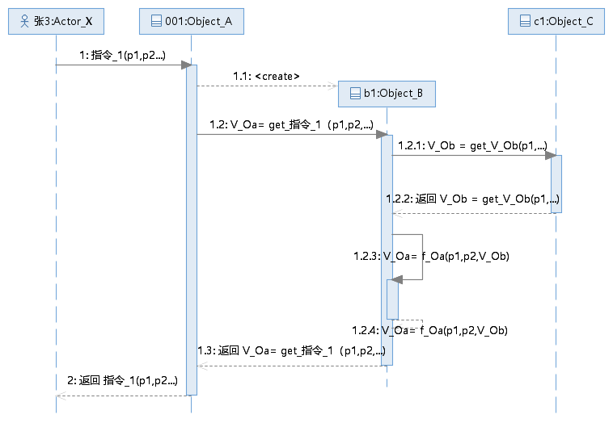
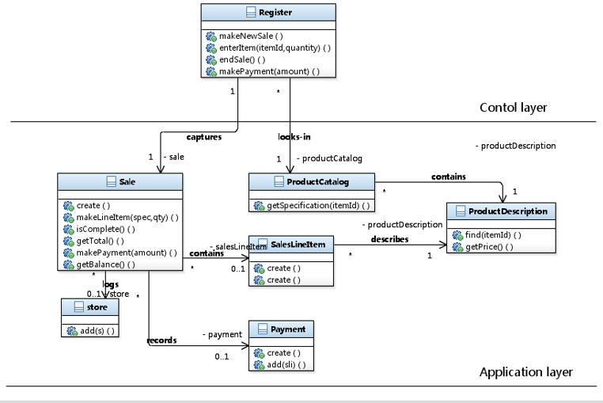

XX系统概要设计

基于UML 的面向对象建模方法

班级_小组：XX_G1

组长：姓名

组员1：姓名

组员2：姓名

....

日期：2023/--/--

**目录**

[1. 软件架构 [3](#软件架构)](#软件架构)

[1.1 软件架构示意图 [3](#软件架构示意图)](#软件架构示意图)

[1.2 分层结构说明 [3](#分层结构说明)](#分层结构说明)

[2. 系统的界面设计 [4](#系统的界面设计)](#系统的界面设计)

[2.1 空调的控制面板设计 [4](#空调的控制面板设计)](#空调的控制面板设计)

[2.2 前台营业员出账单击详单界面设计
[4](#前台营业员办理入住和结账界面设计)](#前台营业员办理入住和结账界面设计)

[2.3 监控空调运行状态的界面设计（可选）
[4](#监控空调运行状态界面设计可选10bonus)](#监控空调运行状态界面设计可选10bonus)

[3. 系统动态结构设计 [5](#系统动态结构设计)](#系统动态结构设计)

[3.1 用例:UC_01 （01 ：需要替换成用例名称）
[5](#用例uc_01-01-需要替换成用例名称)](#用例uc_01-01-需要替换成用例名称)

[3.1.1 已知条件 [5](#已知条件)](#已知条件)

[3.1.2 对象设计：消息名称 （比如：对象设计：指令_1(p1,p2,...)）
[5](#对象设计消息名称-比如对象设计指令_1p1p2...)](#对象设计消息名称-比如对象设计指令_1p1p2...)

[3.1.3 对象设计：消息名称 [6](#对象设计消息名称)](#对象设计消息名称)

[3.2 用例:UC_02 （02 ：需要替换成用例名称）
[7](#用例uc_02-02-需要替换成用例名称)](#用例uc_02-02-需要替换成用例名称)

[3.2.1 已知条件 [7](#已知条件-1)](#已知条件-1)

[3.2.2 对象设计：消息名称 （比如：对象设计：指令_1(p1,p2,...)）
[7](#对象设计消息名称-比如对象设计指令_1p1p2...-1)](#对象设计消息名称-比如对象设计指令_1p1p2...-1)

[3.3 至 最后一个用例 2.6
[7](#至-最后一个用例-2.6)](#至-最后一个用例-2.6)

[3.3.1 已知条件 [7](#已知条件-2)](#已知条件-2)

[3.3.2 对象设计：消息名称 （比如：对象设计：指令_1(p1,p2,...)）
[7](#对象设计消息名称-比如对象设计指令_1p1p2...-2)](#对象设计消息名称-比如对象设计指令_1p1p2...-2)

[4. 系统静态结构设计 [8](#系统静态结构设计)](#系统静态结构设计)

[4.1 用例:UC_01 （01 ：需要替换成用例名称）
[8](#用例uc_01-01-需要替换成用例名称-1)](#用例uc_01-01-需要替换成用例名称-1)

[4.2 用例:UC_01 （01 ：需要替换成用例名称）
[8](#用例uc_01-01-需要替换成用例名称-2)](#用例uc_01-01-需要替换成用例名称-2)

[4.3 用例:UC_03 ... UC_06
[8](#用例uc_03-...-uc_06)](#用例uc_03-...-uc_06)

[3.7 系统级的静态结构 （可选）
[8](#系统级的静态结构-可选)](#系统级的静态结构-可选)

[5. 工作量统计 [9](#工作量统计)](#工作量统计)

# 软件架构

## 软件架构示意图

正文：首先给出系统的整体软件架构的示意图，可以选用诸如Vue、SpringBoot、Django、SSH、SSM等框架，也可以根据情况自定义或者选用教材建议的框架结构；但给出的框架结构与最后的代码结构相一致；其次，根据示意图的内容说明该架构的合理性及其运行机制。

建议参考：http://c.biancheng.net/view/en6pv1.html 如何说明架构的工作原理

## 分层结构说明

正文：如果需要，根据选择的结构，按照层次的划分进行说明：

1.  哪些对象负责接收前端发过来的请求；

2.  哪些对象负责创建对象的实例；

3.  哪些对象负责处理请求的具体要求；

4.  哪些对象负责数据的同步和存储。

# 系统的界面设计

正文：本次作业仅要求各小组给出以下环节的界面设计：

1.  顾客使用空调的控制面板；

2.  前台营业员办理入住和结账的界面；

3.  系统管理员监控空调使用的状态界面（可选，Bonus 10%）;

    说明：界面设计重点在于展示布局以及局部的各功能模块的位置（如果已经有界面，可以截图展示并说明）；

    这里给出了可参考的界面设计：

<!-- -->

1.  <https://www.toutiao.com/article/7280050808686133795/?log_from=3e14959a31fe5_1701671301403；>

2.  <https://www.toutiao.com/article/7308202020518085160/?log_from=6c208ce5cc433_1701671447806；>

3.  https://www.toutiao.com/article/7307879808015581730/?log_from=5342047fcdddd_1701671592111。

## 空调的控制面板设计

## 前台营业员办理入住和结账界面设计

## 监控空调运行状态界面设计（可选，10%Bonus）

# 系统动态结构设计

说明：动态结构的设计内容分成两个环节：基本要求及扩充要求（Bonus 10%）;

基本要求：1、顾客使用空调用例（组员的开机请求不用考虑资源不足的情况）；2、前台营业员办理入住和结账用例。

扩充要求：系统管理员监控空调用例及运行空调用例。

基本要求的用例对应的指令，<u>请具体查看作业要求</u>。

强调，每个指令对应一个UML交互图：确定该指令进入系统后提供服务的各层次的软件对象（<u>参考作为已知条件的操作契约的内容</u>）并为对象分配功能。<u>要求每个组员至少分配2个指令进行设计</u>。

组长负责设计开机请求需要进行调度的交互场景，请参考第一次作业的参考答案中有关调度策略描述的内容作为已知条件，给出优先级调度的交互图和时间片轮询的交互图。

## 用例:UC_01 **（01 ：需要替换成用例名称）**

### 已知条件

正文：用表格的形式给出该用例下所有的消息及对应的返回值；以及每个消息对应的操作契约也作为已知条件。

### 对象设计：消息名称 （比如：对象设计：指令_1(p1,p2,...)）

正文：

1.  首先，给出该消息对应的操作契约作为已知条件；

2.  其次，根据各小组定义的框架结构，结合操作契约的内容（建议以《问题：以及对应的解决方案》的方式）确定第一个接收该消息的软件对象；

3.  然后根据操作契约确定哪一个对象负责创建对象的实例；

4.  哪些对象之间是如何建立关联关系的；

5.  哪个对象的属性需要修改或者初始化。

6.  最后，数据持久化对象的设计可做可不做，如果做了，这部分的内容可以在动态结构设计部分中添加5分的bonus；

7.  在此基础上给出该消息对应的sequence diagram

<figure>

<figcaption>
图 1指令_1(p1,p2,...) 的交互图
样例需替换
</figcaption>
</figure>

说明：

1.  Actor_X：用例中的角色，图中的张3为交互图的实例对象名称，设计时可以不命名；

2.  指令_1(p1,p2,...)：为该用例系统顺序图中的角色与系统之间交互的第1条消息，其中p1,p2...为该消息中的参数；

3.  Object_A：根据选定的系统框架结构中确定的后台接收前端请求的软件对象，其中001为该软件对象的实例对象名称，可以不命名；

4.  Object_B：是根据已知条件操作契约中确定的需要创建的对象实例，为此Object_A在图中使用的消息类型是创建消息，注意消息指向对象实例的顶部；

5.  V_Oa：是对象Object_A
    的一个属性，该属性的取值调用了Object_B的方法：get_指令_1(p1,p2...)；

6.  V_Ob：是对象Object_B的一个属性，该属性的取值调用了Object_C的方法：get_V_Ob(p1,...)；

7.  在获得返回V_Ob 的结果之后，对象Object_B 还需要进行另一个计算并给V_Ob
    进一步赋值，为此该对象调用了自己的一个功能函数 f_Ob(p1,p2,V_Ob)；

8.  Object_B 经过以上操作之后，返回
    V_Oa=get_指令_1(p1,p2...)的结果给Object_A;

9.  Object_A 再将获得结果返回给前端；

10. 通过上面交互图找到前端指令_1(p1,p2,...)进入系统后需要的软件对象Object_A，Object_B和Object_C，以及每个对象具备的功能；

### 对象设计：消息名称

正文：要求同上

......

直到该用例中已知条件中的最后一个消息。

## 用例:UC_02 **（02 ：需要替换成用例名称）**

### 已知条件

正文：用表格的形式给出该用例下所有的消息及对应的返回值；

### 对象设计：消息名称 （比如：对象设计：指令_1(p1,p2,...)）

具体内容与3.1.2 相同

直到该用例中已知条件中的最后一个消息。

......

## 至 最后一个用例 2.6 

### 已知条件

正文：用表格的形式给出该用例下所有的消息及对应的返回值；

### 对象设计：消息名称 （比如：对象设计：指令_1(p1,p2,...)）

具体内容与3.1.2 相同

直到该用例中已知条件中的最后一个消息。

# 系统静态结构设计

## 用例:UC_01 （01 ：需要替换成用例名称）

正文：

1.  根据选定的系统框架结构，给出用例级别的软件分层类图；

2.  对类图中的类进行属性、方法的说明（建议使用表格的形式）；

    

    图 2 样例需替换

## 用例:UC_01 （01 ：需要替换成用例名称）

正文：要求同上；

......

## 用例:UC_03 ... UC_06

正文：要求同上

......

## 3.7 系统级的静态结构 （可选）

正文：仅需给出完整的该系统级的分层软件结构模型的类图。

# 工作量统计

正文：以表格的形式如实给出各个组员的工作内容及工作量描述；

表 4 作业工作内容及工作量统计

| 工作项 | 指令/用例 | 组长 | 组员_1 | 组员_2 | 组员_3 | 组员_4 |
| --- | --- | --- | --- | --- | --- | --- |
| UC_1 | 指令1 |  |  |  |  |  |
| UC_1 | 指令2 |  |  |  |  |  |
| UC_1 | 指令n |  |  |  |  |  |
| UC_1 | 调度指令 | √ | √ | √ | √ | √ |
| UC_1 | 指令1 |  |  |  |  |  |
| UC_1 | 指令2 |  |  |  |  |  |
| UC_1 | 指令n |  |  |  |  |  |
| UC_1 | 指令1 |  |  |  |  |  |
| UC_1 | 指令2 |  |  |  |  |  |
| UC_1 | 指令n |  |  |  |  |  |
| 静态结构设计 | UC_1 |  |  |  |  |  |
| 静态结构设计 | UC_2 |  |  |  |  |  |
| 静态结构设计 | UC_3 |  |  |  |  |  |
| 静态结构设计 | UC_n |  |  |  |  |  |
