<style>
  :root {
    --accent: #1f4e79;
    --line: #b7c6d8;
    --line-strong: #6f87a3;
    --text: #1f2933;
    --muted: #52606d;
    --stripe: #f8fbff;
  }

  body {
    font-family: "Microsoft YaHei", "PingFang SC", sans-serif;
    color: var(--text);
    line-height: 1.75;
    font-size: 14px;
  }

  h1, h2, h3, h4 {
    color: var(--accent);
    font-weight: 700;
  }

  h1 {
    text-align: center;
    font-size: 24px;
    letter-spacing: 0.5px;
    margin-bottom: 18px;
    padding-bottom: 10px;
    border-bottom: 2px solid var(--accent);
  }

  h2 {
    margin-top: 28px;
    padding-left: 10px;
    border-left: 5px solid var(--accent);
    font-size: 20px;
  }

  h3 {
    margin-top: 22px;
    font-size: 17px;
  }

  h4 {
    margin-top: 18px;
    font-size: 15px;
  }

  p, li {
    text-align: justify;
  }

  blockquote {
    margin: 14px 0 18px;
    padding: 10px 14px;
    color: var(--muted);
    background: #f7f9fc;
    border-left: 4px solid var(--accent);
  }

  table {
    width: 100%;
    margin: 14px 0 20px;
    border-collapse: collapse;
    table-layout: fixed;
    font-size: 13px;
  }

  thead { display: table-header-group; }
  tr { page-break-inside: avoid; }

  th, td {
    padding: 9px 10px;
    border: 1px solid var(--line);
    vertical-align: top;
    word-break: break-word;
    overflow-wrap: anywhere;
  }

  th {
    color: #fff;
    background: var(--accent);
    border-color: var(--line-strong);
    text-align: center;
    font-weight: 700;
  }

  tbody tr:nth-child(even) { background: var(--stripe); }

  img { display: block; max-width: 92%; margin: 14px auto 18px; }

  code {
    padding: 1px 5px;
    background: #f3f6fa;
    border-radius: 4px;
    font-size: 0.95em;
  }

  .page-break { page-break-before: always; }
</style>

# 智能充电桩调度计费系统_动态结构与静态结构设计

> 组长：唐振桓  
> 组员1：杨凌俊  
> 组员2：袁炜途  
> 组员3：马迪轩  
> 组员4：刘宇轩  
> 日期：2026/06/02  
> 文档说明：本次作业基于 HW1 已交付的领域模型、用例模型与系统顺序图 (SSD)，进一步细化各系统事件 (除"注册"用例外) 在系统内部的动态协作过程，并补充用例级别的静态结构设计。文档结构与作业模版 (2025年第二次作业模版.md) 对齐：每个用例先列"已知条件"，再按消息逐条进行"对象设计 (操作契约 + 问题/解决方案 + sequence diagram)"，最后按用例给出软件分层类图与属性方法说明表。

## 目录

- [第一章：系统架构选择及说明 (10%)](#第一章系统架构选择及说明-10)
  - [1.1 架构选型](#11-架构选型)
  - [1.2 物理部署与运行视图](#12-物理部署与运行视图)
  - [1.3 三层逻辑分层](#13-三层逻辑分层)
  - [1.4 服务器内部职责划分](#14-服务器内部职责划分)
  - [1.5 与本次作业的对应关系](#15-与本次作业的对应关系)
- [第二章：动态结构设计 (80%)](#第二章动态结构设计-80)
  - [2.1 设计概览与统一图例](#21-设计概览与统一图例)
  - [2.2 用例: 充电申请](#22-用例-充电申请)
  - [2.3 用例: 查看账单 / 查看详单](#23-用例-查看账单--查看详单)
  - [2.4 用例: 运行充电桩](#24-用例-运行充电桩)
  - [2.5 用例: 查看充电桩状态 / 查看队列状态](#25-用例-查看充电桩状态--查看队列状态)
  - [2.6 用例: 调度对象核心交互 (组长完成)](#26-用例-调度对象核心交互-组长完成)
  - [2.7 可选加分调度策略](#27-可选加分调度策略)
- [第三章：静态结构设计 (10%)](#第三章静态结构设计-10)
  - [3.1 用例: 充电申请](#31-用例-充电申请)
  - [3.2 用例: 查看账单 / 查看详单](#32-用例-查看账单--查看详单)
  - [3.3 用例: 运行充电桩](#33-用例-运行充电桩)
  - [3.4 用例: 查看充电桩状态 / 查看队列状态](#34-用例-查看充电桩状态--查看队列状态)
  - [3.5 用例: 调度对象核心交互](#35-用例-调度对象核心交互)
  - [3.6 系统级的静态结构 (可选)](#36-系统级的静态结构-可选)
- [第四章：系统事件人员分配](#第四章系统事件人员分配)

<div class="page-break"></div>

# 第一章：系统架构选择及说明 (10%)

## 1.1 架构选型

综合需求说明书的三个核心约束——(1) 系统由"服务器端 + 用户客户端 + 管理员客户端"三方构成、(2) 排队调度、计费和故障恢复均需要全局状态一致、(3) 充电桩状态需要在客户端定时刷新——本系统选择"**客户端-服务器架构 (C/S) + 三层逻辑分层 + 服务端 MVC**"的复合方案，并在服务器内部按职责进一步划分为"边界 (Boundary) — 控制 (Control) — 实体 (Entity)"三类协作对象，便于在第二章用动态图清晰地表达每一个系统事件。

放弃 B/S 纯浏览器方案的原因：管理员客户端需要长连接接收充电桩状态轮询和故障告警，用户客户端需要长连接接收"叫号"推送，而本系统又部署在校内私网，C/S 在长连接、即时通知和本地缓存方面优于一般 B/S。放弃微服务方案的原因：5 个充电桩 + 单一充电站的部署规模不构成分服务的必要业务边界，分布式事务反而会显著增加调度一致性维护成本。

## 1.2 物理部署与运行视图

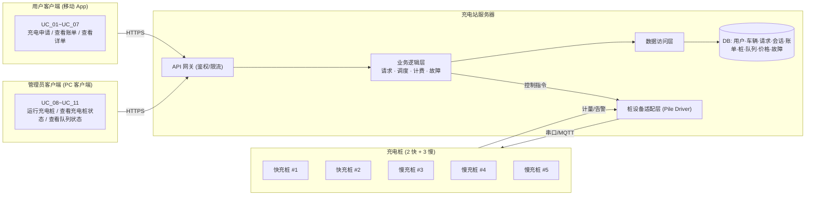

> 充电桩设备本身不直接对接客户端：所有控制指令 (启动、停止、参数下发) 和状态回采 (计量、告警) 都经过服务器的"桩设备适配层"，这样可以保证状态在服务器端有唯一可信副本，便于调度。

## 1.3 三层逻辑分层

| 层 | 主要职责 | 对应类型示例 |
| --- | --- | --- |
| 表示层 (Presentation) | 屏幕渲染、表单校验、推送接收、本地缓存 | `UserClient` / `AdminClient` 及其内部 View/ViewModel |
| 业务逻辑层 (Business Logic) | 用例级控制逻辑、调度算法、计费规则、超时与故障策略 | `ChargeRequestController` / `ScheduleManager` / `BillingService` / `FaultService` / `PileService` |
| 数据访问层 (Data Access) | 持久化、事务、唯一性约束、并发控制 | `RequestRepo` / `SessionRepo` / `BillRepo` / `PileRepo` / `PriceRepo` |

## 1.4 服务器内部职责划分

服务器在业务逻辑层内部进一步采用 BCE (Boundary-Control-Entity) 模式：

- **Boundary (边界对象)** ：每个用例对应一个 `XxxController`，承担鉴权、参数校验、把客户端协议消息映射成内部消息。
- **Control (控制对象)** ：跨多个实体协调的服务对象，如 `ScheduleManager` (排队/分桩)、`BillingService` (计费)、`FaultService` (故障)。
- **Entity (实体对象)** ：HW1 领域模型中 18 个类的实现，承担属性持久化和不变量自检。

第二章每张时序图中的 lifeline 都遵循该划分，命名方式为 `:ClassName` 表示对象，斜杠/箭头采用 UML 2 标准记法。

## 1.5 与本次作业的对应关系

- 本章 (10%) 给出整体架构图与分层划分，作为后续两章的协作上下文。
- 第二章 (80%) 中所有系统事件均落在"用户/管理员客户端 → API 网关 → Controller → Service → Entity → Repo"这条链路上；调度策略与故障恢复增加 `ScheduleManager` 和 `FaultService` 之间的内部交互。
- 第三章 (10%) 仅保留与系统事件直接相关的类，仅使用依赖、定向关联与继承三种关系，符合作业要求。

<div class="page-break"></div>

# 第二章：动态结构设计 (80%)

## 2.1 设计概览与统一图例

本章共给出 **15** 个必做系统事件的时序图、**3** 个组长必做的调度对象交互图，以及 **2** 个可选加分调度策略的时序图，合计 **20** 张 UML Sequence Diagram。每个用例严格按模版要求组织：**已知条件 → 对象设计 (操作契约 + 问题/解决方案 + sequence diagram) → 直到该用例最后一个消息**。

为保证图与图之间的一致性，所有时序图遵循以下约定：

1. 全部使用 UML 2 sequence diagram 记法；同步消息使用实心三角箭头，异步消息使用细线开放箭头，返回值使用虚线箭头。
2. lifeline 命名遵循 `角色 / :类名` 的形式；同一个类在不同时序图中保持同一命名。
3. 控制结构使用 `alt / opt / loop / par` 复合片段，约束信息写在 `note` 中。
4. 系统事件名 (来自作业要求表格) 在第一条消息上以加粗形式显示，参数列表与原表格完全一致。
5. 与 HW1 操作契约保持一致：前置条件不满足则进入 `alt 异常` 分支返回错误码 `1`；正常路径返回 `0` 或题目要求的对象。

为便于参与对象交叉引用，下表列出贯穿全章的核心对象：

| 简写 | 全名 | 所在层 | 角色 |
| --- | --- | --- | --- |
| `:UserClient` | 用户客户端 | 表示层 | 用户操作入口 |
| `:AdminClient` | 管理员客户端 | 表示层 | 管理员操作入口 |
| `:ChargeReqCtrl` | `:ChargeRequestController` | 业务边界 | 充电申请系列用例的 Controller |
| `:BillCtrl` | `:BillController` | 业务边界 | 账单/详单用例的 Controller |
| `:PileCtrl` | `:PileController` | 业务边界 | 运行/查询充电桩用例的 Controller |
| `:QueueCtrl` | `:QueueController` | 业务边界 | 查看队列状态用例的 Controller |
| `:ScheduleMgr` | `:ScheduleManager` | 业务控制 | 调度算法与队列调度入口 |
| `:BillingSvc` | `:BillingService` | 业务控制 | 计费、生成账单与详单 |
| `:FaultSvc` | `:FaultService` | 业务控制 | 故障识别、再调度、故障恢复 |
| `:PileSvc` | `:PileService` | 业务控制 | 充电桩生命周期 (上电/启动/关闭) |
| `:WaitingArea` | 等候区 | 实体 | 持有两个等待队列 |
| `:WaitingQueue` | 等待队列 (快/慢) | 实体 | FIFO 队列 |
| `:ChargingArea` | 充电区 | 实体 | 持有 5 个充电桩 |
| `:ChargingPile` | 充电桩 | 实体 | 桩内 4 位排队队列 |
| `:Req` | `:ChargingRequest` | 实体 | 单次请求生命周期对象 |
| `:Session` | `:ChargingSession` | 实体 | 充电会话 (实时电量、时长) |
| `:Bill` | `:Bill` | 实体 | 一次会话对应一份账单/详单 |
| `:PricingRule` | 分时电价规则 | 实体 | 三段式电价 |
| `:ServiceRule` | 服务费规则 | 实体 | 服务费率 |
| `:PileDriver` | 桩设备适配层 | 设备 | 与物理桩交换控制/计量信号 |
| `:RequestRepo` | 请求数据访问对象 | 数据访问 | 充电请求的持久化与活跃请求查询、欠费校验 |
| `:SessionRepo` | 会话数据访问对象 | 数据访问 | 当前在充/历史充电会话的持久化与查询 |
| `:BillRepo` | 账单数据访问对象 | 数据访问 | 账单按车/按日/按 ID 查询与落盘 |
| `:PileRepo` | 桩数据访问对象 | 数据访问 | 桩状态、累计计数器的持久化与快照 |
| `:PriceRepo` | 电价数据访问对象 | 数据访问 | 分时电价规则、服务费规则的版本化存储 |

> 命名映射说明：作业要求表中的英文消息名 (例如 `E_chargingRequest`) 是"系统事件"层面，对应 HW1 操作契约中的 `SubmitChargeRequest` 等编程名。本章在第一条消息上**严格使用作业要求表中的命名**，以满足"标黄系统事件"的覆盖要求。

<div class="page-break"></div>

## 2.2 用例: 充电申请

### 2.2.1 已知条件

本用例下所有系统事件及对应返回值如下表 (与作业要求表完全一致)，每个系统事件对应的操作契约在下文"对象设计"小节中作为该消息的已知条件分别给出。

| 序号 | 指令 | 系统事件 | 返回 |
| --- | --- | --- | --- |
| 1 | 提交充电申请 | `E_chargingRequest(car_Id, Request_Amount, Request_Mode)` | `Return(car_position, car_state, queue_Num, request_time)` |
| 2 | 修改充电量 | `Modify_Amount(car_Id, Amount)` | `Return(0/1)` |
| 3 | 修改充电模式 | `Modify_Mode(car_Id, Mode)` | `Return(0/1)` |
| 4 | 查看队列状态 | `Query_Car_State(car_Id)` | `Return(car_Number_before_position, car_state, queue_Num, request_time)` |
| 5 | 开始充电 | `Start_Charging(car_Id, ChargePileNum)` | `Return(0/1)` |
| 6 | 查看充电状态 | `Query_Charging_State(car_Id)` | `Return(详单信息)` |
| 7 | 结束充电 | `End_Charging(car_Id, ChargePileNum)` | `Return(0/1)` |

### 2.2.2 对象设计：E_chargingRequest(car_Id, Request_Amount, Request_Mode)

**(1) 操作契约 (已知条件)**

| 项目 | 内容 |
| --- | --- |
| 系统事件 | `E_chargingRequest(car_Id, Request_Amount, Request_Mode)` |
| 交叉引用 | UC_01 充电申请 — 提交充电申请 |
| 前置条件 | 1. 车辆 `car_Id` 已通过等候区入场鉴权。 2. 用户和车辆身份有效。 3. 当前不存在该车辆未完成的有效充电请求。 4. 用户不存在未支付且已超期的账单限制。 |
| 后置条件 | 1. 创建一个新的 `:ChargingRequest`。 2. 与 `:User`、`:Vehicle` 建立关联。 3. 系统根据 `Request_Mode` 将其加入对应模式的 `:WaitingQueue`。 4. 初始化请求 `state=排队中`，记录 `request_time`、`target_amount=Request_Amount`、由队列分配 `queue_Num`。 5. 更新等待队列长度与预计等待时长。 6. 向客户端返回 `car_position / car_state / queue_Num / request_time`。 |

**(2) 问题与解决方案**

| 问题 | 解决方案 |
| --- | --- |
| 第一个接收该消息的软件对象是谁? | 后台边界对象 `:ChargeRequestController`，负责鉴权、参数校验，并把外部消息转为内部领域消息。 |
| 谁负责创建 `:ChargingRequest` 实例? | `:ScheduleManager` 在 `createRequest()` 中创建实例，并委托 `:RequestRepo` 持久化。 |
| 哪些对象之间需要建立关联? | 新建 `:ChargingRequest` 通过 `:WaitingArea.getQueue(mode)` 找到对应 `:WaitingQueue`，再 `enqueue` 进去；同时记录 `User/Vehicle` 引用。 |
| 哪些属性需要初始化或修改? | `:ChargingRequest` 的 `state=排队中`、`request_time=now`、`target_amount=Request_Amount`、`queue_Num` 由 `:WaitingQueue` 分配；`:WaitingQueue.size++`。 |
| 是否需要数据持久化对象? | 是 — `:RequestRepo` 通过 `save(:Req)` 持久化新请求，落入 `requests` 表 (本节作为 5% bonus 项保留)。 |

**(3) Sequence Diagram**

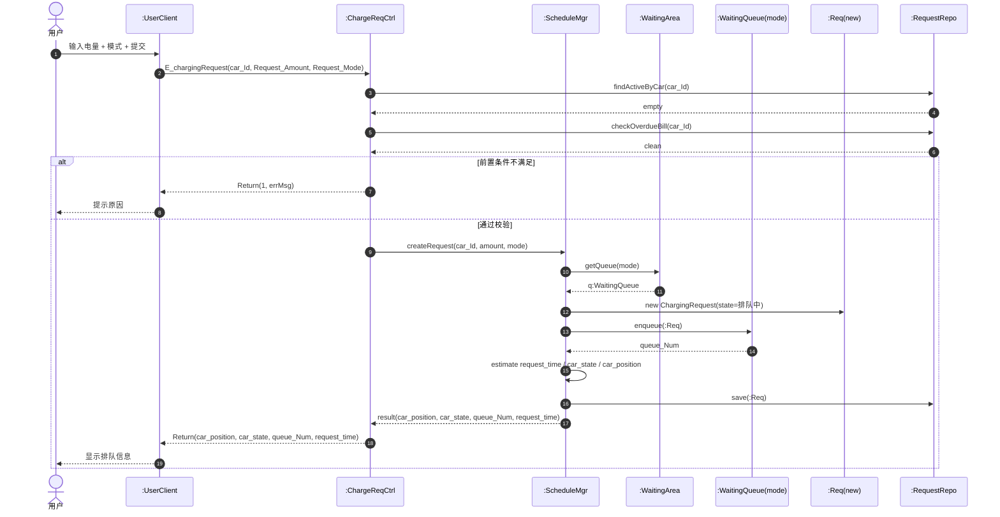

> 说明：`car_state` 取值与 HW1 一致，含"排队中 / 已调度未开始 / 充电中 / 已完成 / 已取消"。

### 2.2.3 对象设计：Modify_Amount(car_Id, Amount)

**(1) 操作契约 (已知条件)**

| 项目 | 内容 |
| --- | --- |
| 系统事件 | `Modify_Amount(car_Id, Amount)` |
| 交叉引用 | UC_01 充电申请 — 修改充电量 |
| 前置条件 | 1. 对应 `:ChargingRequest` 存在。 2. 请求当前状态为"排队中"或"已调度未开始充电"。 3. 新的目标电量 `Amount > 0` 且符合业务规则。 |
| 后置条件 | 1. 原 `:ChargingRequest.target_amount` 被更新为 `Amount`。 2. 由 `:ScheduleManager` 重新计算预计等待时长。 3. 不重新生成新请求 (仅修改电量不重排队)。 4. 向用户返回 `0` (成功) 或 `1` (拒绝)。 |

**(2) 问题与解决方案**

| 问题 | 解决方案 |
| --- | --- |
| 谁负责接收该消息? | `:ChargeRequestController` 继续作为充电申请系列用例的边界。 |
| 谁负责状态校验? | 控制器查 `:RequestRepo` 获得当前请求，再读 `:Req.state`；若已进入 `充电中` 直接返回 `1`。 |
| 哪些对象需要交互? | `:ChargeReqCtrl → :Req` 调用 `setTargetAmount(Amount)`；`:ChargeReqCtrl → :ScheduleMgr` 调用 `recomputeWaitTime(:Req)`。 |
| 哪些属性发生修改? | `:Req.target_amount` 由旧值改为 `Amount`，`:Req.modified_at = now`。 |

**(3) Sequence Diagram**

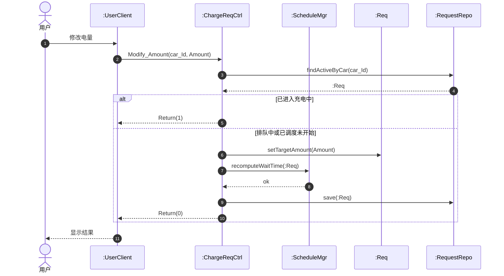

### 2.2.4 对象设计：Modify_Mode(car_Id, Mode)

**(1) 操作契约 (已知条件)**

| 项目 | 内容 |
| --- | --- |
| 系统事件 | `Modify_Mode(car_Id, Mode)` |
| 交叉引用 | UC_01 充电申请 — 修改充电模式 |
| 前置条件 | 1. 对应 `:ChargingRequest` 存在。 2. 请求状态为"排队中"或"已调度未开始充电"。 3. `Mode` 与当前模式不同。 |
| 后置条件 | 1. 原 `:ChargingRequest` 被标记为"已取消"，并从原 `:WaitingQueue` 移除。 2. 创建一个新的 `:ChargingRequest`，模式为 `Mode`，加入新模式队列尾部 (公平原则)。 3. 重新计算预计等待时长。 4. 向用户返回新的 `queue_Num`。 |

**(2) 问题与解决方案**

| 问题 | 解决方案 |
| --- | --- |
| 为何不能在原 `:Req` 上原地切换模式? | 业务规则要求"换队即重排"，避免插队；故需取消旧请求并以新模式重新排队。 |
| 谁负责创建新请求? | `:ChargeRequestController` 直接 `new ChargingRequest(mode=Mode)`，并委托 `:ScheduleMgr` 计算新预计时长。 |
| 哪些 `:WaitingQueue` 受影响? | 旧模式队列执行 `remove(:Req(old))`；新模式队列执行 `enqueue(:Req(new))`。 |
| 哪些属性需要修改? | `:Req(old).state=已取消`、`:Req(new).state=排队中`、`:Req(new).queue_Num` 由队列分配。 |

**(3) Sequence Diagram**

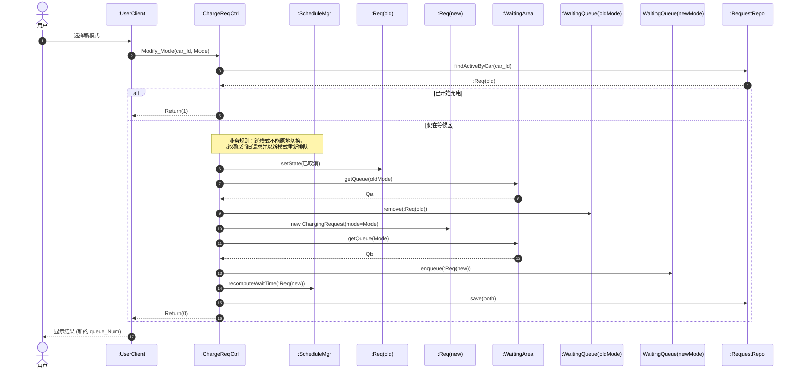

### 2.2.5 对象设计：Query_Car_State(car_Id)

**(1) 操作契约 (已知条件)**

| 项目 | 内容 |
| --- | --- |
| 系统事件 | `Query_Car_State(car_Id)` |
| 交叉引用 | UC_01 充电申请 — 查看队列状态 |
| 前置条件 | 1. 对应 `:ChargingRequest` 存在且状态为非终态 (非"已完成"/"已取消")。 2. 用户具备查询该请求的权限。 |
| 后置条件 | 1. 读取该 `:Req` 当前 `state`、所属 `:WaitingQueue`、当前排队位置和预计等待时间。 2. 不修改任何持久化业务对象，仅返回最新队列视图。 |

**(2) 问题与解决方案**

| 问题 | 解决方案 |
| --- | --- |
| 谁负责拼装返回视图? | `:ChargeRequestController` 编排查询，组合 `:Req` 自身属性与 `:WaitingQueue.positionOf()` 的结果。 |
| 为何不直接读 `:WaitingQueue.list()`? | 队列长度可能远大于该请求所需信息，故只取 `positionOf` 以节省传输与计算量。 |
| 是否会触发副作用? | 无。`Query` 是只读视图，必须保证不修改任何业务对象状态。 |

**(3) Sequence Diagram**

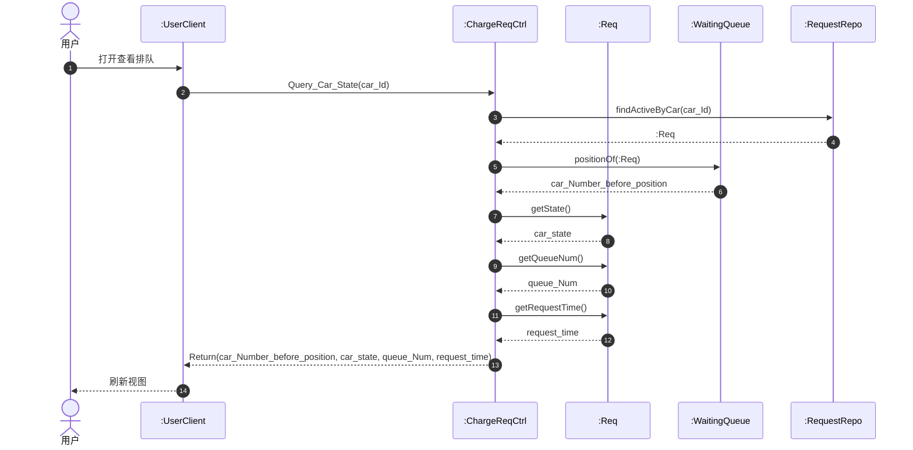

### 2.2.6 对象设计：Start_Charging(car_Id, ChargePileNum)

**(1) 操作契约 (已知条件)**

| 项目 | 内容 |
| --- | --- |
| 系统事件 | `Start_Charging(car_Id, ChargePileNum)` |
| 交叉引用 | UC_01 充电申请 — 开始充电 |
| 前置条件 | 1. 该 `:Req` 已被调度到 `ChargePileNum` 对应的 `:ChargingPile`。 2. 用户在 5 分钟叫号窗口内确认入场。 3. 该桩当前处于"空闲"或"占用 (但已就绪)" 状态。 4. 该车在桩内排队队首。 |
| 后置条件 | 1. 创建新的 `:ChargingSession`，与该 `:Req`、`:Pile` 建立关联。 2. `:Req.state=充电中`、`:Pile.state=占用`。 3. 通过 `:PileDriver` 下发启动指令。 4. 记录 `Session.startTime=now`。 |

**(2) 问题与解决方案**

| 问题 | 解决方案 |
| --- | --- |
| 谁负责创建 `:ChargingSession`? | `:ChargeReqCtrl` 在校验通过后 `new ChargingSession(:Req, :Pile, startTime=now)`；交由 `:SessionRepo` 持久化。 |
| 如何校验"队首"? | `:ScheduleMgr` 调用 `:Pile.peekHead()`，判断返回的请求 ID 与 `car_Id` 一致。 |
| 哪些状态需要同步修改? | `:Req.state → 充电中`、`:Pile.state → 占用`、新建的 `:Session.status = CHARGING`。 |
| 物理设备如何介入? | `:ChargeReqCtrl` 通过 `:PileDriver.startCharging(ChargePileNum, mode)` 下发启动命令；等待 `ack` 后才返回 `0`。 |

**(3) Sequence Diagram**

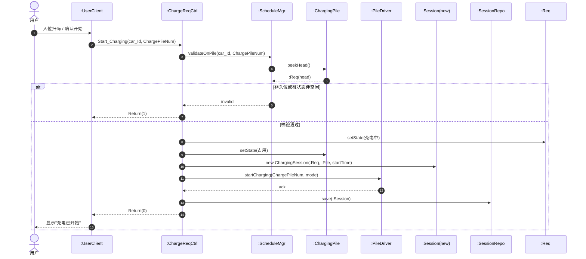

### 2.2.7 对象设计：Query_Charging_State(car_Id)

**(1) 操作契约 (已知条件)**

| 项目 | 内容 |
| --- | --- |
| 系统事件 | `Query_Charging_State(car_Id)` |
| 交叉引用 | UC_01 充电申请 — 查看充电状态 |
| 前置条件 | 1. 当前该车辆存在 `state=充电中` 的 `:ChargingSession`。 |
| 后置条件 | 1. 从 `:PileDriver` 拉取实时计量值 (累计 kWh、累计时长)。 2. 用当前时刻计算分时电价段 `chargeRate` 与服务费率 `serviceRate`。 3. 计算实时费用 `kWh * (chargeRate + serviceRate)`。 4. 返回详单实时信息 (`pileNum / startTime / kWh / duration / chargeFee / serviceFee / totalFee`)。 5. 不修改持久化业务对象 (`:Session` 仅做内存中实时刷新)。 |

**(2) 问题与解决方案**

| 问题 | 解决方案 |
| --- | --- |
| 实时电量从哪里来? | 从物理桩经 `:PileDriver.pullRealtime(pileId)` 获取计量，避免依赖客户端上报。 |
| 分时电价怎么算? | `:PricingRule.rateAt(now)` 返回当前时段电价；服务费固定由 `:ServiceRule.rate()` 提供。 |
| 是否需要持久化? | 不需要 — 实时查询仅刷新 `:Session.kwh` 和 `:Session.duration` 的内存视图，账单要等 `End_Charging` 时才生成。 |

**(3) Sequence Diagram**

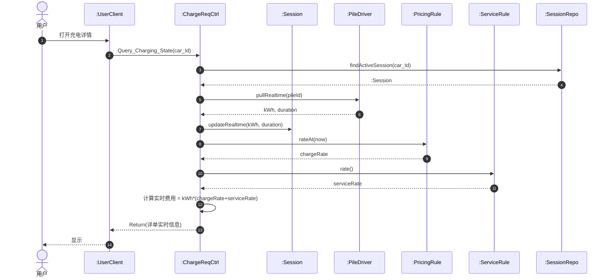

> 返回字段按需求说明含：pileNum, startTime, 当前 kWh, 当前 duration, 估算 chargeFee, 估算 serviceFee, 当前总费用，与"详单信息"字段一一对应。

### 2.2.8 对象设计：End_Charging(car_Id, ChargePileNum)

**(1) 操作契约 (已知条件)**

| 项目 | 内容 |
| --- | --- |
| 系统事件 | `End_Charging(car_Id, ChargePileNum)` |
| 交叉引用 | UC_01 充电申请 — 结束充电 |
| 前置条件 | 1. 该车辆存在 `state=充电中` 的 `:Session`，且 `Session.pileId=ChargePileNum`。 |
| 后置条件 | 1. `:PileDriver.stopCharging(pileId)` 下发停止指令；获取最终 kWh / duration / 分段计量。 2. `:Session.finalize(kWh, duration, endTime)`，`:Session.status=COMPLETED`。 3. `:BillingSvc.generateBill(:Session)` 创建 `:Bill`。 4. `:Pile.state=空闲`，**立即释放车位**，与支付无关。 5. `:ScheduleMgr.onPileFreed(:Pile)` 触发下一辆调入。 |

**(2) 问题与解决方案**

| 问题 | 解决方案 |
| --- | --- |
| 谁负责生成账单? | `:BillingService.generateBill(:Session)`，输入会话对象，依据 `:PricingRule.ratesBetween(start, end)` 分段计费，再加服务费。 |
| 桩何时释放? | 在 `:Session.finalize()` 后立即 `:Pile.setState(空闲)`；不等待支付完成 (业务规则)。 |
| 下一辆怎么调入? | `:ScheduleMgr.onPileFreed(:Pile)` 内部从桩内排队队列取队首；若桩内为空，则从等候区按调度策略选取。 |
| 哪些属性受影响? | `:Session.endTime/kWh/duration/status`；`:Pile.state`；`:Req.state → 已完成`；新生 `:Bill.totalFee/payState`。 |

**(3) Sequence Diagram**

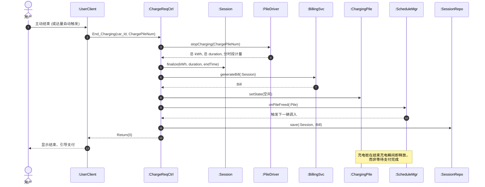

<div class="page-break"></div>

## 2.3 用例: 查看账单 / 查看详单

### 2.3.1 已知条件

本用例下系统事件及返回值如下，每个系统事件对应的操作契约在下文"对象设计"小节作为已知条件给出。

| 序号 | 指令 | 系统事件 | 返回 |
| --- | --- | --- | --- |
| 1 | 查看账单申请 | `Request_Bill(carId, date)` | `Return(carId, date, Bill_Id, ChargePileNum, ChargeAmount, ChargeDuration, StartTime, EndTime, TotalChargeFee, TotalServiceFee, TotalFee)` |
| 2 | 查看详单申请 (子) | `Request_DetailedList(Bill_Id)` | `Return(carId, date, Bill_Id, ChargePileNum, ChargeAmount, ChargeDuration, StartTime, EndTime, ChargeFee, ServiceFee, subtotalFee)` |

### 2.3.2 对象设计：Request_Bill(carId, date)

**(1) 操作契约 (已知条件)**

| 项目 | 内容 |
| --- | --- |
| 系统事件 | `Request_Bill(carId, date)` |
| 交叉引用 | UC_02 查看账单 — 查看账单申请 |
| 前置条件 | 1. 用户身份合法。 2. 查询日期 `date` 不晚于当日。 |
| 后置条件 | 1. 读取该车 `carId` 在 `date` 当天结束的全部 `:Session` 所对应的 `:Bill` 集合。 2. 按 `ChargeAmount / Duration / TotalChargeFee / TotalServiceFee / TotalFee` 累加形成汇总账单视图。 3. 不修改任何持久化业务对象，仅返回视图。 |

**(2) 问题与解决方案**

| 问题 | 解决方案 |
| --- | --- |
| 谁负责接收该消息? | `:BillController` 作为账单/详单用例的边界。 |
| 谁负责聚合? | `:BillingService.aggregateBills(carId, date)` 由 `:BillRepo.findByCarAndDate` 拿到列表后逐条累加。 |
| 返回 `Bill_Id` 在汇总场景下含义? | 若当日只有 1 条账单则返回该 `Bill_Id`；多条时返回 `Bill_Id*` 列表以便用户进入"详单"页。 |

**(3) Sequence Diagram**

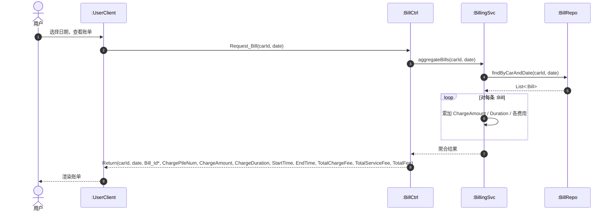

### 2.3.3 对象设计：Request_DetailedList(Bill_Id)

**(1) 操作契约 (已知条件)**

| 项目 | 内容 |
| --- | --- |
| 系统事件 | `Request_DetailedList(Bill_Id)` |
| 交叉引用 | UC_02 查看账单 (子) — 查看详单申请 |
| 前置条件 | 1. `Bill_Id` 存在且属于当前用户。 |
| 后置条件 | 1. 读取 `:Bill` 及其 `:Session`。 2. 通过 `:PricingRule.ratesBetween(startTime, endTime)` 与 `:ServiceRule.rate()` 计算分时段的 `ChargeFee / ServiceFee / subtotalFee`。 3. 返回详单字段。 4. 不修改持久化业务对象。 |

**(2) 问题与解决方案**

| 问题 | 解决方案 |
| --- | --- |
| 详单数据从哪里来? | 已持久化的 `:Bill` 提供合计信息；明细分段需要再调一次 `:PricingRule` 还原。 |
| 谁负责生成分段明细? | `:BillingService.explodeDetail(:Bill, rates)` 在内存中根据电价时段拆分，不写回数据库。 |

**(3) Sequence Diagram**

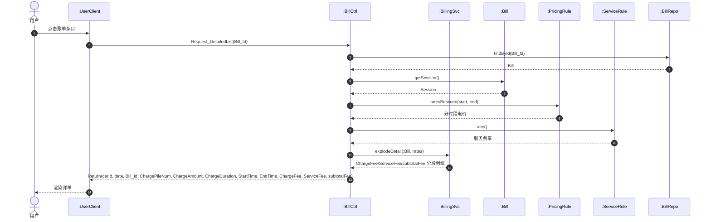

<div class="page-break"></div>

## 2.4 用例: 运行充电桩

### 2.4.1 已知条件

本用例下系统事件及返回值如下，每个系统事件对应的操作契约在下文"对象设计"小节作为已知条件给出。

| 序号 | 指令 | 系统事件 | 返回 |
| --- | --- | --- | --- |
| 1 | 启动充电桩 | `powerOn(pile_Id)` | `Return(0/1)` |
| 2 | 设置参数 | `setParameters(计费规则, 三个时段的电价数据等)` | `Return(0/1)` |
| 3 | 运行充电桩 | `Start_ChargingPile(pile_Id)` | `Return(0/1)` |
| 4 | 关闭充电桩 | `powerOff(pile_Id)` | `Return(0/1)` |

### 2.4.2 对象设计：powerOn(pile_Id)

**(1) 操作契约 (已知条件)**

| 项目 | 内容 |
| --- | --- |
| 系统事件 | `powerOn(pile_Id)` |
| 交叉引用 | UC_03 运行充电桩 — 启动充电桩 |
| 前置条件 | 1. 管理员身份合法。 2. `:ChargingPile` 存在且当前状态为"未通电/关闭"。 |
| 后置条件 | 1. `:PileDriver.powerOn(pile_Id)` 给物理桩供电。 2. `:Pile.state=待运行`。 3. `:PileRepo` 持久化新状态。 |

**(2) 问题与解决方案**

| 问题 | 解决方案 |
| --- | --- |
| 谁负责接收该消息? | `:PileController` 作为管理员侧充电桩用例的边界。 |
| 是否直接操作硬件? | 否，控制器把请求转给 `:PileService.powerOn(pile_Id)`，由后者经 `:PileDriver` 下发。 |
| 哪些属性需要修改? | `:Pile.state` 从"未通电"改为"待运行"；其余统计字段不变。 |

**(3) Sequence Diagram**

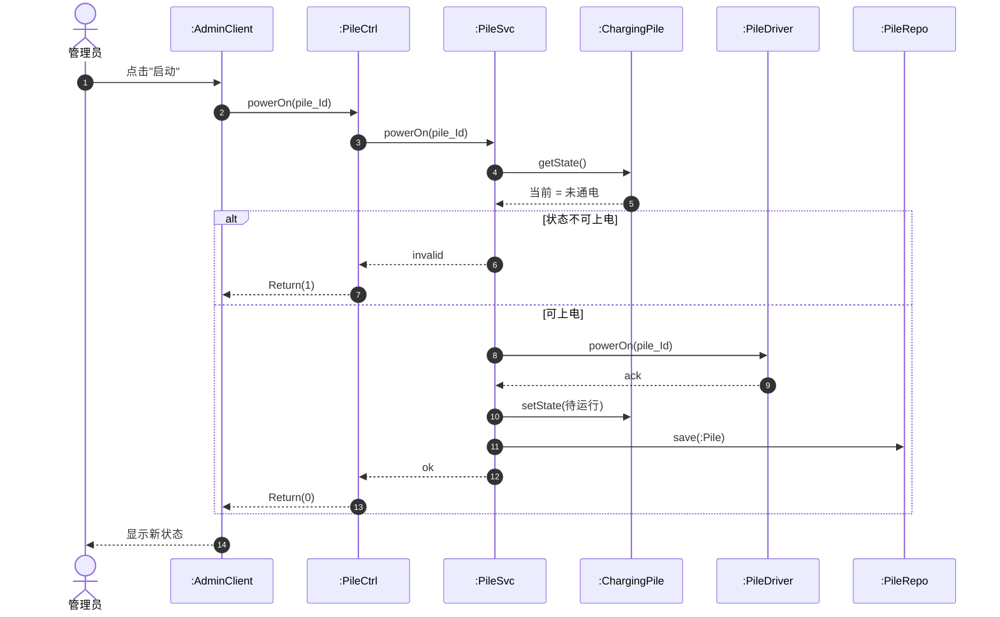

### 2.4.3 对象设计：setParameters(计费规则, 三个时段的电价数据等)

**(1) 操作契约 (已知条件)**

| 项目 | 内容 |
| --- | --- |
| 系统事件 | `setParameters(billingRule, peakRate, normalRate, valleyRate, serviceRate)` |
| 交叉引用 | UC_03 运行充电桩 — 设置参数 |
| 前置条件 | 1. 管理员身份合法。 2. 三个时段电价 + 服务费率均 `> 0`。 |
| 后置条件 | 1. 更新 `:PricingRule.{peakRate, normalRate, valleyRate}`、`:ServiceRule.rate`、`validFrom=now`。 2. 通过 `:PileDriver.pushParam` 把新参数下发到所有运行中的 5 个 `:ChargingPile`。 3. 持久化到 `:PriceRepo`。 |

**(2) 问题与解决方案**

| 问题 | 解决方案 |
| --- | --- |
| 价格对象更新策略? | 不在原对象上原地改值 — 而是 `:PricingRule.update(...)` 内部创建一条新版本记录，便于回溯历史账单分段计费。 |
| 5 个桩如何同步? | 在 `:PileService.applyParameters` 内部用 `par` 并行块向 5 个 `:PileDriver` 端点下发 `pushParam`。 |
| 是否影响在充会话? | 仅影响 `validFrom` 之后开始的会话；当前在充会话依旧使用其会话开始时的电价时段表 (历史一致性)。 |

**(3) Sequence Diagram**

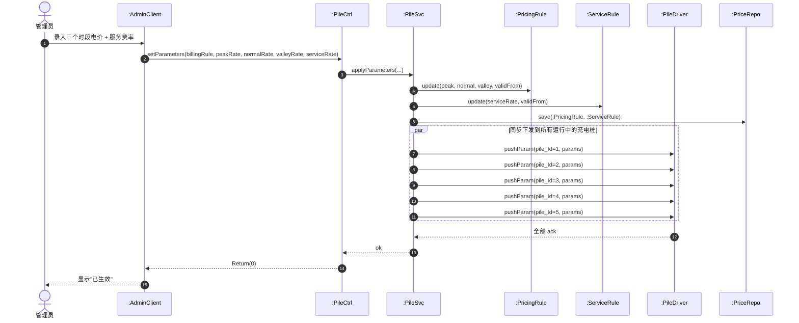

### 2.4.4 对象设计：Start_ChargingPile(pile_Id)

**(1) 操作契约 (已知条件)**

| 项目 | 内容 |
| --- | --- |
| 系统事件 | `Start_ChargingPile(pile_Id)` |
| 交叉引用 | UC_03 运行充电桩 — 运行充电桩 |
| 前置条件 | 1. `:Pile.state=待运行` (即已 `powerOn` 但尚未投入服务)。 |
| 后置条件 | 1. `:PileDriver.startService(pile_Id)` 进入对外服务模式。 2. `:Pile.state=空闲`。 3. `:ScheduleMgr.registerAvailable(:Pile)` 触发调度入队；若同模式 `:WaitingQueue` 有等待车辆，立即开始调入。 |

**(2) 问题与解决方案**

| 问题 | 解决方案 |
| --- | --- |
| 谁向调度器宣告"新桩可用"? | `:PileService.start` 完成后调用 `:ScheduleMgr.registerAvailable(:Pile)`。 |
| 状态校验失败如何处理? | 直接返回 `1` (例如未通电先调用本指令则拒绝)。 |
| 与 `powerOn` 的区别? | `powerOn` 仅给桩通电，桩自检；`Start_ChargingPile` 才真正接入调度，开始接受调入。 |

**(3) Sequence Diagram**

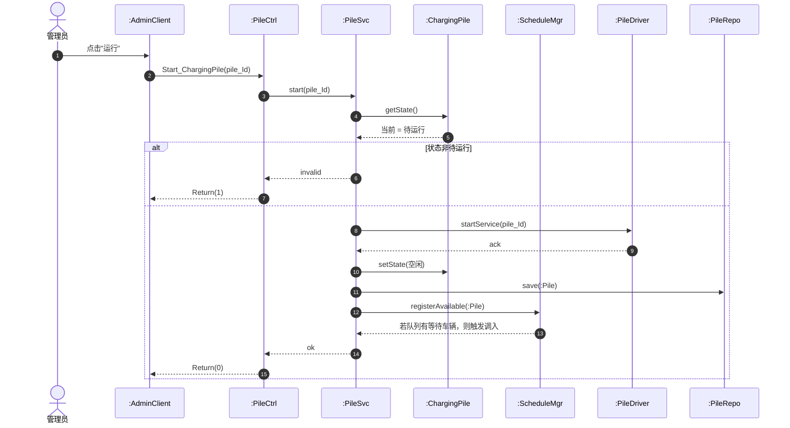

### 2.4.5 对象设计：powerOff(pile_Id)

**(1) 操作契约 (已知条件)**

| 项目 | 内容 |
| --- | --- |
| 系统事件 | `powerOff(pile_Id)` |
| 交叉引用 | UC_03 运行充电桩 — 关闭充电桩 |
| 前置条件 | 1. `:Pile` 存在。 |
| 后置条件 | 1. 若该桩当前正在为某辆车充电，先 `:Session.finalize(snapshot)` 并由 `:BillingSvc.generateBill` 出阶段账单。 2. 桩内排队车辆经 `:ScheduleMgr.returnWaitersToWaitingArea(:Pile)` 回到等候区。 3. `:PileDriver.powerOff(pile_Id)` 物理断电。 4. `:Pile.state=关闭`，`:ScheduleMgr.unregisterAvailable(:Pile)` 不再参与调度。 |

**(2) 问题与解决方案**

| 问题 | 解决方案 |
| --- | --- |
| 关闭时是否允许中断在充会话? | 业务允许 — `:Session` 立即结束并出阶段账单；用户被通知。 |
| 桩内排队车辆如何处理? | 由 `:ScheduleMgr.returnWaitersToWaitingArea(:Pile)` 把它们以原 `request_time` 退回等候区，保持公平。 |
| 与故障 (FaultService) 的区别? | `powerOff` 是管理员主动维护，`onPileFault` 是异常事件；前者不创建 `:FaultRecord`。 |

**(3) Sequence Diagram**

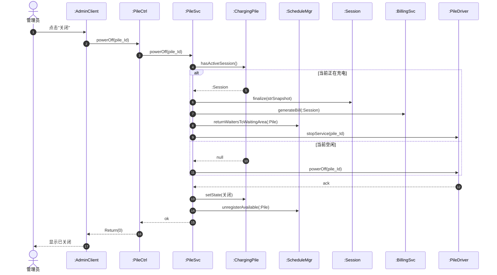

<div class="page-break"></div>

## 2.5 用例: 查看充电桩状态 / 查看队列状态

### 2.5.1 已知条件

本用例下系统事件及返回值如下，每个系统事件对应的操作契约在下文"对象设计"小节作为已知条件给出。

| 序号 | 指令 | 系统事件 | 返回 |
| --- | --- | --- | --- |
| 1 | 查看充电桩状态 (定时刷新) | `Query_PileState(pile_Id)` | `Return(workingState, TotalChargeNum, TotalChargeTime, TotalCapacity)` |
| 2 | 查看队列状态 (子) | `Query_QueueState(queuelist)` | `Return(car_Id, car_Capacity, Request_Amount, waitTime)` |

### 2.5.2 对象设计：Query_PileState(pile_Id)

**(1) 操作契约 (已知条件)**

| 项目 | 内容 |
| --- | --- |
| 系统事件 | `Query_PileState(pile_Id)` |
| 交叉引用 | UC_04 查看充电桩状态 |
| 前置条件 | 1. 管理员登录。 2. `:Pile` 存在；`pile_Id` 为空表示全量查询 (展开为 5 个并行 `Query_PileState`)。 |
| 后置条件 | 1. 读取 `:Pile.workingState`。 2. 由 `:PileDriver.pullCounters` 获取累计 `TotalChargeNum / TotalChargeTime / TotalCapacity`。 3. `:PileRepo.snapshot(:Pile)` 写回最新计数 (可视为副作用，便于运营报表)。 |

**(2) 问题与解决方案**

| 问题 | 解决方案 |
| --- | --- |
| 客户端如何实现定时刷新? | `:AdminClient` 内部按 `refreshInterval=N` (默认 5s) 周期调用本接口；服务端不维护推送通道。 |
| 5 个桩并发查询如何组织? | 在 `:PileController` 内部展开为 5 个并行任务，避免阻塞。 |
| 该指令是否修改业务对象? | 仅写入桩累计计数快照 (`snapshot`)，不改变核心状态字段；视为只读+计数副作用。 |

**(3) Sequence Diagram**

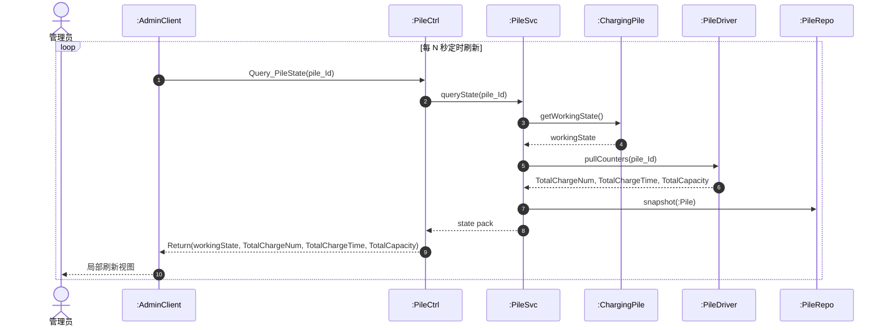

> 客户端依据 N (默认 5s) 周期发起请求；当 pile_Id 为空时由 `:PileCtrl` 内部展开为 5 个并行 `queryState`。

### 2.5.3 对象设计：Query_QueueState(queuelist)

**(1) 操作契约 (已知条件)**

| 项目 | 内容 |
| --- | --- |
| 系统事件 | `Query_QueueState(queuelist)` |
| 交叉引用 | UC_04 查看队列状态 (子) |
| 前置条件 | 1. 管理员登录。 2. `queuelist` 中的每个队列 ID 都存在 (等候区 fast/slow，或 5 个桩内队列)。 |
| 后置条件 | 1. 对每个队列读取队列中 `:Req` 列表。 2. 对每个请求估算 `waitTime` (等待至开始充电的分钟数)。 3. 返回每条记录 `(car_Id, car_Capacity, Request_Amount, waitTime)`。 4. 不修改持久化业务对象。 |

**(2) 问题与解决方案**

| 问题 | 解决方案 |
| --- | --- |
| 谁负责跨等候区/桩内队列的统一查询? | `:QueueController` 调用 `:ScheduleMgr.snapshot(queueId)`；后者根据 `queueId` 在 `:WaitingArea` 与 `:ChargingArea` 中分发。 |
| `waitTime` 如何估算? | 等候区中: 排在前面的所有请求充电时长 + 桩平均排队时长；桩内队列: 在充会话剩余 + 之前各位等候充电时长。 |
| 是否需要锁? | 不需要，整个查询是只读快照；估算函数容忍短暂的并发漂移。 |

**(3) Sequence Diagram**

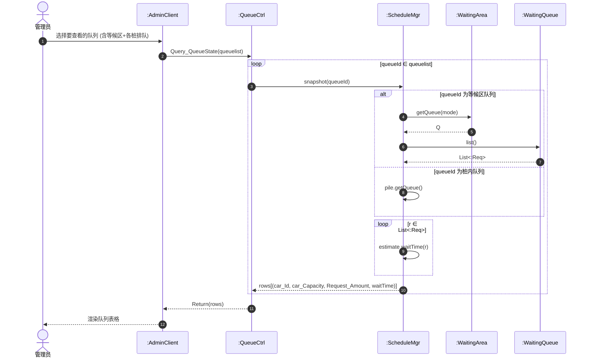

<div class="page-break"></div>

## 2.6 用例: 调度对象核心交互 (组长完成)

本节由组长 **唐振桓** 完成，针对充电过程中出现一个充电桩故障的情况，分别给出 (1) 优先级调度、(2) 时间顺序调度、(3) 充电中故障恢复 三种调度对象之间的交互过程。

### 2.6.1 已知条件

公共前提：5 个充电桩中 `Pile_F` 在某辆车 `Car_X` 充电过程中发生硬件故障。`Car_X` 已充入 `Δ` 度电、`Pile_F` 队尾还排有 `Car_Y` (尚未开始充电)。下文三张图分别使用不同的"再调度"策略来处理。

参与调度的对象与外部消息如下：

| 序号 | 事件 | 调度交互 | 输出 |
| --- | --- | --- | --- |
| 1 | 优先级调度 | `onPileFault(pile_F)`，保留 `Car_X` 原优先级直接调入同模式空闲桩 | `dispatchNotify(Car_X, Pile_Other)` |
| 2 | 时间顺序调度 | `onPileFault(pile_F)`，把 `Car_X`/`Car_Y` 都按原 `request_time` 退回等待队列 | `按新 FIFO 通知队首车辆` |
| 3 | 充电中故障恢复 | `ResumePile(pile_F)` 后重新参与同模式调度 | `dispatchNotify(:Req(head), :Pile_F)` |

操作契约 (合并表述以避免重复)：

| 项目 | 内容 |
| --- | --- |
| 系统事件 | `onPileFault(pile_F)` (由 `:PileDriver` 异步告警触发) 和 `ResumePile(pile_F)` |
| 交叉引用 | UC_03/UC_04 调度对象核心交互 |
| 前置条件 | 1. `Pile_F` 正处于服务中或被告警检测到硬件异常。 2. 故障告警进入 `:FaultSvc`。 |
| 后置条件 (故障) | 1. `:Pile_F.state=故障中`。 2. 在充会话 `:Session(Car_X)` 立即 `stopMeter` 并出阶段账单。 3. 创建续充 `:Req(Car_X 续充)`；按策略 (优先级 / 时间顺序) 加入同模式等待队列或直接调入空闲桩。 4. 桩内未开始的请求 (`Car_Y`) 按策略退回等待队列。 |
| 后置条件 (恢复) | 1. `:Pile_F.state=空闲`，`:FaultRecord.close()`。 2. `:ScheduleMgr.registerAvailable(:Pile_F)` 触发同模式调入。 3. 把"故障中断"会话的快照费用合并到主账单。 |

### 2.6.2 对象设计：优先级调度

**问题与解决方案**

| 问题 | 解决方案 |
| --- | --- |
| `Car_X` 续充请求是否需要重新排队? | 不需要 — 复用其原 `request_time`，确保位于所有同模式新车之前。 |
| 谁负责"绕过等待区直接进入空闲桩"? | `:ScheduleMgr` 在收到 `:FaultSvc` 通知后，立刻在同模式 `:Pile_Other` 中找空位，若有则直接 enqueue。 |

**Sequence Diagram**

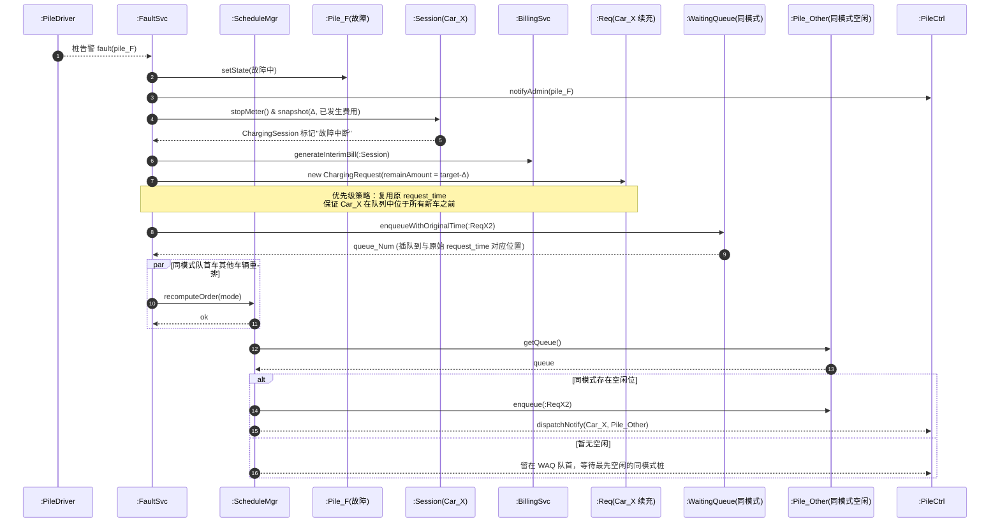

### 2.6.3 对象设计：时间顺序调度

**问题与解决方案**

| 问题 | 解决方案 |
| --- | --- |
| 受影响请求如何统一处理? | 都退回到等待队列；按各自原 `request_time` 重排，不区分"原本排队"和"被故障撞回"。 |
| 谁负责把桩内队列回流? | `:FaultSvc.drainAllPendingTo(WAQ)` 把 `Pile_F` 未开始的请求逐条 `enqueueByRequestTime`。 |

**Sequence Diagram**

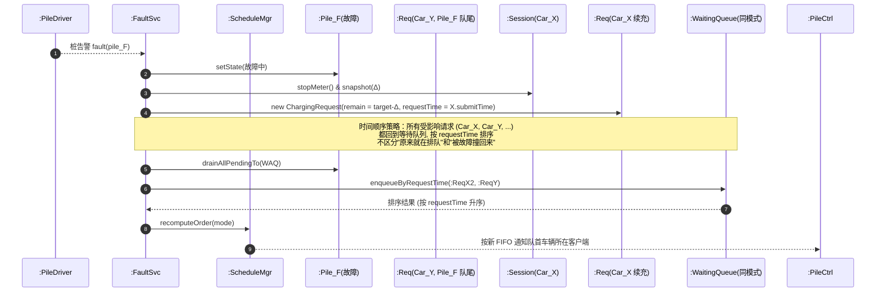

### 2.6.4 对象设计：充电中故障恢复

**问题与解决方案**

| 问题 | 解决方案 |
| --- | --- |
| 桩恢复后是否需要重启服务? | 是 — `:PileSvc.resume` 先调 `:PileDriver.selfTest`，自检通过才 `setState(空闲)` 并 `registerAvailable`。 |
| "故障中断"会话费用如何与新账单合并? | `:BillingSvc.finalizeInterruptedSessions(pile_F)` 把快照费用合并到当前主账单 (如有)。 |

**Sequence Diagram**

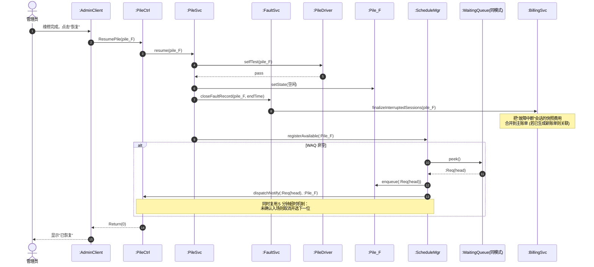

<div class="page-break"></div>

## 2.7 可选加分调度策略

本节面向作业要求中的两项可选加分项：单次调度总充电时长最短、批量调度总充电时长最短。两项均聚焦"完成充电所需时间 = 等待时长 + 自己充电时长"的最小化策略，且不与 2.6.1/2.6.2 冲突，而是作为"被调度对象进入充电区瞬间"的桩选择策略。

> 形式化定义：设当前模式空闲桩集合为 `P*`，对每个候选 `p ∈ P*`，候选请求 `r` 选择 `p` 的总完成时间为 `T(r,p) = sum(remain_charge_time of p's current queue) + r.amount / p.rate`。

### 2.7.1 对象设计：单次调度总充电时长最短

**问题与解决方案**

| 问题 | 解决方案 |
| --- | --- |
| 决策粒度? | 单次：每出队一辆车，独立选择当时使其 `T(r,p)` 最小的桩。 |
| 其它车辆是否重排? | 不重排；保持简单与可解释性。 |

**Sequence Diagram**

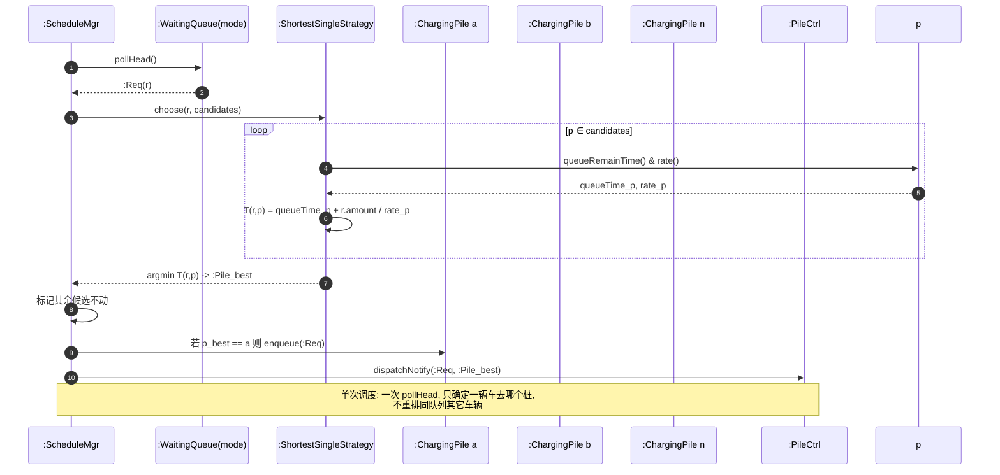

### 2.7.2 对象设计：批量调度总充电时长最短

**问题与解决方案**

| 问题 | 解决方案 |
| --- | --- |
| 何时触发批量优化? | 周期性 (例如调度 tick) 或某桩进入空闲时一次性优化全部等待请求。 |
| 是否破坏 FIFO? | 在 FIFO 顺序内贪心选择最低 `ΔT` 的桩，保留先到先服务的相对顺序约束。 |

**Sequence Diagram**

```mermaid
sequenceDiagram
    autonumber
    participant Trg as :Trigger(周期性/桩空闲)
    participant Sch as :ScheduleMgr
    participant WAQ as :WaitingQueue(mode)
    participant Pol as :ShortestBatchStrategy
    participant PSet as :ChargingPiles(mode 全部)
    participant PC as :PileCtrl

    Trg->>Sch: triggerBatchDispatch(mode)
    Sch->>WAQ: snapshotAll()
    WAQ-->>Sch: R = [r1, r2, ..., rk]
    Sch->>PSet: snapshotQueues()
    PSet-->>Sch: 各桩当前剩余排队
    Sch->>Pol: optimize(R, piles)
    Note over Pol: 策略目标:<br/>min Σ_i T(r_i, assign(r_i))<br/>约束: 同模式 / 桩内 ≤ 4 位 / FIFO 受理顺序优先
    loop 每个 r_i (按 FIFO 顺序遍历)
        Pol->>Pol: 对每个可用 p, 估算 ΔT
        Pol->>Pol: r_i -> argmin ΔT
    end
    Pol-->>Sch: 分配方案 {r_i -> p_j}
    loop (r_i, p_j) ∈ 方案
        Sch->>PSet: enqueueTo(p_j, :Req(r_i))
        Sch->>WAQ: remove(:Req(r_i))
        Sch->>PC: dispatchNotify(:Req(r_i), :Pile(p_j))
    end
    Note over Sch,PC: 批量调度: 一次决策 k 辆车的整体最优,<br/>显著优于逐辆贪心
```

<div class="page-break"></div>

# 第三章：静态结构设计 (10%)

本章按模版要求逐个用例给出"软件分层类图 + 类属性与方法说明表"，统一只使用 **依赖、定向关联、继承** 三种关系：

- **继承 (Generalization)** ：`▷`，仅用于充电桩家族。
- **定向关联 (Directed Association)** ：`──▶`，表示一个类持有另一个类的引用。
- **依赖 (Dependency)** ：`╌╌▷`，表示一个类在方法签名/调用中使用另一个类，但不持有其引用。

每张类图仅包含本用例时序图涉及的类；继承自父类的成员不在子类表中重复列出。

## 3.1 用例: 充电申请

### 3.1.1 软件分层类图

```mermaid
classDiagram
    direction LR

    class UserClient
    class ChargeRequestController
    class ScheduleManager
    class BillingService
    class WaitingArea
    class WaitingQueue
    class ChargingArea
    class ChargingPile
    class FastChargingPile
    class SlowChargingPile
    class ChargingRequest
    class ChargingSession
    class Bill
    class PricingRule
    class ServiceFeeRule
    class PileDriver
    class Vehicle
    class User

    ChargingPile <|-- FastChargingPile
    ChargingPile <|-- SlowChargingPile

    UserClient --> ChargeRequestController
    ChargeRequestController --> ScheduleManager
    ChargeRequestController --> BillingService
    ScheduleManager --> WaitingArea
    ScheduleManager --> ChargingArea
    ScheduleManager --> ChargingRequest
    WaitingArea --> WaitingQueue
    ChargingArea --> ChargingPile
    WaitingQueue --> ChargingRequest
    ChargingPile --> ChargingRequest
    ChargingRequest --> ChargingSession
    ChargingSession --> Bill
    Bill --> PricingRule
    Bill --> ServiceFeeRule
    User --> Vehicle
    Vehicle --> ChargingRequest

    ChargeRequestController ..> PileDriver
    BillingService ..> ChargingSession
    ScheduleManager ..> ChargingPile
```

### 3.1.2 属性与方法说明

| 类名 | 主要属性 | 主要方法 (与本用例消息对应) |
| --- | --- | --- |
| `UserClient` | currentUserId, currentVehicleId, sessionToken | submitChargeRequest(), modifyAmount(), modifyMode(), queryCarState(), startCharging(), queryChargingState(), endCharging() |
| `ChargeRequestController` | — | `E_chargingRequest`, `Modify_Amount`, `Modify_Mode`, `Query_Car_State`, `Start_Charging`, `Query_Charging_State`, `End_Charging` |
| `ScheduleManager` | strategy, waitingArea, chargingArea | createRequest(), recomputeWaitTime(), validateOnPile(), onPileFreed() |
| `BillingService` | pricingRule, serviceRule | generateBill(), aggregateBills(), explodeDetail() |
| `WaitingArea` | capacity | getQueue(mode) |
| `WaitingQueue` | mode, items: List<ChargingRequest> | enqueue(), pollHead(), peek(), positionOf(), list(), remove() |
| `ChargingArea` | spotPerPile=4 | listPiles(), countFreeSpots() |
| `ChargingPile` | pileId, type, state, rate, totalChargeNum, totalChargeTime, totalCapacity, queue | getState(), setState(), enqueue(), peekHead(), queueRemainTime(), hasActiveSession() |
| `FastChargingPile` | rate=30kW | — (继承 ChargingPile) |
| `SlowChargingPile` | rate=7kW | — (继承 ChargingPile) |
| `ChargingRequest` | requestId, carId, mode, targetAmount, state, requestTime, queueNum, originalRequestTime | setState(), setTargetAmount(), getState(), getQueueNum(), getRequestTime() |
| `ChargingSession` | sessionId, requestId, pileId, startTime, endTime, kWh, duration, status | updateRealtime(), finalize(), stopMeter() |
| `Bill` | billId, sessionId, chargeAmount, chargeDuration, startTime, endTime, totalChargeFee, totalServiceFee, totalFee, payState | computeFromSession(), getDetail(), markPaid() |
| `PricingRule` | peakRate, normalRate, valleyRate, peakRange, valleyRange, validFrom | rateAt(time), ratesBetween(t1,t2) |
| `ServiceFeeRule` | rate, validFrom | rate() |
| `PileDriver` | endpoints: Map<pileId, ConnectionInfo> | startCharging(), stopCharging(), pullRealtime() |
| `User` | userId, userName | hasOverdueBill(), addVehicle() |
| `Vehicle` | vehicleId, carCapacity | getOwner(), getActiveRequest() |

<div class="page-break"></div>

## 3.2 用例: 查看账单 / 查看详单

### 3.2.1 软件分层类图

```mermaid
classDiagram
    direction LR

    class UserClient
    class BillController
    class BillingService
    class Bill
    class ChargingSession
    class PricingRule
    class ServiceFeeRule
    class BillRepo

    UserClient --> BillController
    BillController --> BillingService
    BillingService --> Bill
    BillingService --> PricingRule
    BillingService --> ServiceFeeRule
    Bill --> ChargingSession
    Bill --> PricingRule
    Bill --> ServiceFeeRule

    BillController ..> BillRepo
    BillingService ..> ChargingSession
```

### 3.2.2 属性与方法说明

| 类名 | 主要属性 | 主要方法 |
| --- | --- | --- |
| `UserClient` | currentUserId | requestBill(), requestDetailedList() |
| `BillController` | — | `Request_Bill`, `Request_DetailedList` |
| `BillingService` | pricingRule, serviceRule | aggregateBills(), explodeDetail() |
| `Bill` | billId, sessionId, carId, date, chargeAmount, chargeDuration, startTime, endTime, totalChargeFee, totalServiceFee, totalFee | getSession(), getDetail() |
| `ChargingSession` | sessionId, pileId, startTime, endTime, kWh | finalize() |
| `PricingRule` | peakRate, normalRate, valleyRate, peakRange, valleyRange | rateAt(time), ratesBetween(t1,t2) |
| `ServiceFeeRule` | rate | rate() |
| `BillRepo` | — | findByCarAndDate(), findById() |

<div class="page-break"></div>

## 3.3 用例: 运行充电桩

### 3.3.1 软件分层类图

```mermaid
classDiagram
    direction LR

    class AdminClient
    class PileController
    class PileService
    class ScheduleManager
    class BillingService
    class ChargingPile
    class FastChargingPile
    class SlowChargingPile
    class ChargingSession
    class PricingRule
    class ServiceFeeRule
    class PileDriver
    class PileRepo
    class PriceRepo

    ChargingPile <|-- FastChargingPile
    ChargingPile <|-- SlowChargingPile

    AdminClient --> PileController
    PileController --> PileService
    PileService --> ChargingPile
    PileService --> PricingRule
    PileService --> ServiceFeeRule
    PileService --> ScheduleManager

    PileService ..> PileDriver
    PileService ..> PileRepo
    PileService ..> PriceRepo
    PileService ..> ChargingSession
    PileService ..> BillingService
```

### 3.3.2 属性与方法说明

| 类名 | 主要属性 | 主要方法 |
| --- | --- | --- |
| `AdminClient` | adminId | powerOn(), setParameters(), startChargingPile(), powerOff() |
| `PileController` | — | `powerOn`, `setParameters`, `Start_ChargingPile`, `powerOff` |
| `PileService` | — | powerOn(), powerOff(), start(), applyParameters() |
| `ScheduleManager` | strategy | registerAvailable(), unregisterAvailable(), returnWaitersToWaitingArea() |
| `BillingService` | pricingRule, serviceRule | generateBill() |
| `ChargingPile` | pileId, type, state, rate, totalChargeNum, totalChargeTime, totalCapacity | getState(), setState(), hasActiveSession() |
| `FastChargingPile` | rate=30kW | — (继承) |
| `SlowChargingPile` | rate=7kW | — (继承) |
| `ChargingSession` | sessionId, kWh, duration | finalize(), snapshot() |
| `PricingRule` | peakRate, normalRate, valleyRate, validFrom | update() |
| `ServiceFeeRule` | rate, validFrom | update() |
| `PileDriver` | endpoints | powerOn(), powerOff(), startService(), stopService(), pushParam() |
| `PileRepo` | — | save(), snapshot() |
| `PriceRepo` | — | save() |

<div class="page-break"></div>

## 3.4 用例: 查看充电桩状态 / 查看队列状态

### 3.4.1 软件分层类图

```mermaid
classDiagram
    direction LR

    class AdminClient
    class PileController
    class QueueController
    class PileService
    class ScheduleManager
    class ChargingPile
    class FastChargingPile
    class SlowChargingPile
    class WaitingArea
    class WaitingQueue
    class ChargingRequest
    class PileDriver
    class PileRepo

    ChargingPile <|-- FastChargingPile
    ChargingPile <|-- SlowChargingPile

    AdminClient --> PileController
    AdminClient --> QueueController
    PileController --> PileService
    QueueController --> ScheduleManager
    PileService --> ChargingPile
    ScheduleManager --> WaitingArea
    WaitingArea --> WaitingQueue
    WaitingQueue --> ChargingRequest
    ChargingPile --> ChargingRequest

    PileService ..> PileDriver
    PileService ..> PileRepo
    QueueController ..> WaitingQueue
    ScheduleManager ..> ChargingPile
```

### 3.4.2 属性与方法说明

| 类名 | 主要属性 | 主要方法 |
| --- | --- | --- |
| `AdminClient` | adminId, refreshInterval | queryPileState(), queryQueueState() |
| `PileController` | — | `Query_PileState` |
| `QueueController` | — | `Query_QueueState` |
| `PileService` | — | queryState() |
| `ScheduleManager` | — | snapshot(queueId), estimateWaitTime() |
| `ChargingPile` | pileId, workingState, totalChargeNum, totalChargeTime, totalCapacity, queue | getWorkingState(), getQueue(), queueRemainTime(), pullCounters() |
| `FastChargingPile`, `SlowChargingPile` | rate=30/7kW | — (继承) |
| `WaitingArea` | — | getQueue(mode) |
| `WaitingQueue` | mode, items | list(), positionOf() |
| `ChargingRequest` | requestId, carId, carCapacity, requestAmount, requestTime | getState() |
| `PileDriver` | endpoints | pullCounters() |
| `PileRepo` | — | snapshot() |

<div class="page-break"></div>

## 3.5 用例: 调度对象核心交互

### 3.5.1 软件分层类图

```mermaid
classDiagram
    direction LR

    class AdminClient
    class PileController
    class PileService
    class FaultService
    class ScheduleManager
    class BillingService
    class ChargingPile
    class FastChargingPile
    class SlowChargingPile
    class WaitingArea
    class WaitingQueue
    class ChargingRequest
    class ChargingSession
    class Bill
    class FaultRecord
    class AbnormalReport
    class PileDriver

    ChargingPile <|-- FastChargingPile
    ChargingPile <|-- SlowChargingPile

    AdminClient --> PileController
    PileController --> PileService
    PileController --> FaultService
    FaultService --> ChargingPile
    FaultService --> FaultRecord
    FaultService --> AbnormalReport
    FaultService --> ScheduleManager
    FaultService --> BillingService
    ScheduleManager --> WaitingArea
    ScheduleManager --> ChargingRequest
    WaitingArea --> WaitingQueue
    WaitingQueue --> ChargingRequest
    ChargingPile --> ChargingRequest
    ChargingRequest --> ChargingSession
    ChargingSession --> Bill

    FaultService ..> PileDriver
    PileService ..> PileDriver
    ScheduleManager ..> ChargingPile
```

### 3.5.2 属性与方法说明

| 类名 | 主要属性 | 主要方法 |
| --- | --- | --- |
| `AdminClient` | adminId | confirmPileFault(), resumePile() |
| `PileController` | — | `ConfirmPileFault`, `ResumePile`, `notifyAdmin` |
| `PileService` | — | resume() |
| `FaultService` | activeFaults: Map<pileId, FaultRecord> | onPileFault(), drainAllPendingTo(), closeFaultRecord(), recomputeOrderAfterFault(), finalizeInterruptedSessions() |
| `ScheduleManager` | strategy | recomputeOrder(mode), registerAvailable(), dispatchNotify() |
| `BillingService` | pricingRule, serviceRule | generateInterimBill(), finalizeInterruptedSessions() |
| `ChargingPile` | pileId, state, queue, rate | setState(), getQueue(), drainAllPendingTo() |
| `FastChargingPile`, `SlowChargingPile` | rate | — (继承) |
| `WaitingArea` / `WaitingQueue` | — | enqueueWithOriginalTime(), enqueueByRequestTime(), peek() |
| `ChargingRequest` | requestId, carId, mode, targetAmount, state, requestTime, originalRequestTime | setState() |
| `ChargingSession` | sessionId, kWh, status, snapshotFee | stopMeter(), snapshot() |
| `Bill` | billId, sessionId, totalFee, payState | computeFromSession() |
| `FaultRecord` | faultId, pileId, faultType, faultTime, endTime, sourceReportId | open(), close() |
| `AbnormalReport` | reportId, userId, pileId, description, reportTime | bindTo(pile) |
| `PileDriver` | endpoints | selfTest() |

<div class="page-break"></div>

## 3.6 系统级的静态结构 (可选)

合并上述五个用例的类与关系，得到本系统的总体软件分层结构模型。仅使用模版要求的三种关系。

```mermaid
classDiagram
    direction LR

    class UserClient
    class AdminClient
    class ChargeRequestController
    class BillController
    class PileController
    class QueueController
    class ScheduleManager
    class BillingService
    class FaultService
    class PileService

    class ChargingStation
    class WaitingArea
    class ChargingArea
    class WaitingQueue
    class ChargingPile
    class FastChargingPile
    class SlowChargingPile
    class User
    class Vehicle
    class ChargingRequest
    class ChargingSession
    class Bill
    class PricingRule
    class ServiceFeeRule
    class AbnormalReport
    class FaultRecord
    class PileDriver

    %% 继承
    ChargingPile <|-- FastChargingPile
    ChargingPile <|-- SlowChargingPile

    %% 表示层 -> 边界
    UserClient --> ChargeRequestController
    UserClient --> BillController
    AdminClient --> PileController
    AdminClient --> QueueController

    %% 边界 -> 控制
    ChargeRequestController --> ScheduleManager
    ChargeRequestController --> BillingService
    BillController --> BillingService
    PileController --> PileService
    PileController --> FaultService
    QueueController --> ScheduleManager

    %% 控制 -> 实体 (持有引用)
    ScheduleManager --> WaitingArea
    ScheduleManager --> ChargingArea
    ScheduleManager --> ChargingRequest
    BillingService --> Bill
    BillingService --> PricingRule
    BillingService --> ServiceFeeRule
    FaultService --> ChargingPile
    FaultService --> FaultRecord
    FaultService --> AbnormalReport
    PileService --> ChargingPile

    %% 实体之间的关联
    ChargingStation --> WaitingArea
    ChargingStation --> ChargingArea
    WaitingArea --> WaitingQueue
    ChargingArea --> ChargingPile
    WaitingQueue --> ChargingRequest
    ChargingPile --> ChargingRequest
    User --> Vehicle
    Vehicle --> ChargingRequest
    ChargingRequest --> ChargingSession
    ChargingSession --> Bill
    Bill --> PricingRule
    Bill --> ServiceFeeRule

    %% 设备适配 (依赖)
    PileService ..> PileDriver
    FaultService ..> PileDriver
    BillingService ..> ChargingSession
    ScheduleManager ..> ChargingPile
    QueueController ..> WaitingQueue
```

> 备注：图中刻意避免使用聚合 / 组合 / 关联类等 HW1 已使用过的关系符号；本次只保留作业要求的三种关系，所有"整体-局部"语义统一弱化为"定向关联"。各类的属性与方法详见 3.1 ~ 3.5 节按用例给出的说明表。

<div class="page-break"></div>

# 第四章：系统事件人员分配

> 说明：本节按作业要求给出"系统事件 → 责任人"的分工，便于评审追踪。组长部分由唐振桓承担；其余系统事件均匀分给四位组员。统稿、文档美化、交叉检查仍由全组协同。

## 4.1 系统事件分工表

| 类别 | 系统事件 | 主要负责人 | 协作 |
| --- | --- | --- | --- |
| 充电申请 | `E_chargingRequest` | 杨凌俊 | 唐振桓 |
| 充电申请 | `Modify_Amount` | 杨凌俊 | 袁炜途 |
| 充电申请 | `Modify_Mode` | 袁炜途 | 杨凌俊 |
| 充电申请 | `Query_Car_State` | 刘宇轩 | 杨凌俊 |
| 充电申请 | `Start_Charging` | 马迪轩 | 唐振桓 |
| 充电申请 | `Query_Charging_State` | 马迪轩 | 袁炜途 |
| 充电申请 | `End_Charging` | 袁炜途 | 唐振桓 |
| 查看账单 | `Request_Bill` | 刘宇轩 | 袁炜途 |
| 查看详单 | `Request_DetailedList` | 刘宇轩 | 袁炜途 |
| 运行充电桩 | `powerOn` | 马迪轩 | 杨凌俊 |
| 运行充电桩 | `setParameters` | 马迪轩 | 袁炜途 |
| 运行充电桩 | `Start_ChargingPile` | 杨凌俊 | 唐振桓 |
| 运行充电桩 | `powerOff` | 杨凌俊 | 马迪轩 |
| 查看充电桩状态 | `Query_PileState` | 刘宇轩 | 马迪轩 |
| 查看队列状态 | `Query_QueueState` | 袁炜途 | 刘宇轩 |
| 调度交互 (组长) | 优先级调度 | **唐振桓** | 全组 |
| 调度交互 (组长) | 时间顺序调度 | **唐振桓** | 全组 |
| 调度交互 (组长) | 充电中故障恢复 | **唐振桓** | 全组 |
| 加分项 | 单次调度总充电时长最短 | 唐振桓 + 袁炜途 | 杨凌俊 |
| 加分项 | 批量调度总充电时长最短 | 唐振桓 + 杨凌俊 | 刘宇轩 |

## 4.2 文档与统稿分工

| 工作项 | 唐振桓 | 杨凌俊 | 袁炜途 | 马迪轩 | 刘宇轩 |
| --- | --- | --- | --- | --- | --- |
| 第一章 系统架构选择及说明 | √ | √ |  |  |  |
| 第二章 时序图绘制 (Mermaid) |  | √ | √ | √ | √ |
| 第三章 用例级类图与说明表 | √ |  | √ |  | √ |
| 调度对象交互 (2.6 节) | √ |  |  |  |  |
| 加分项策略 (2.7 节) | √ | √ | √ |  |  |
| Markdown 排版与目录 |  |  |  | √ | √ |
| 全文复核与提交 | √ |  |  |  | √ |

> 评分说明：本节按作业第 4 条要求列出系统事件的人员分配。若漏写本节，按作业要求最高扣 5 分；本节本身不计入正分。
