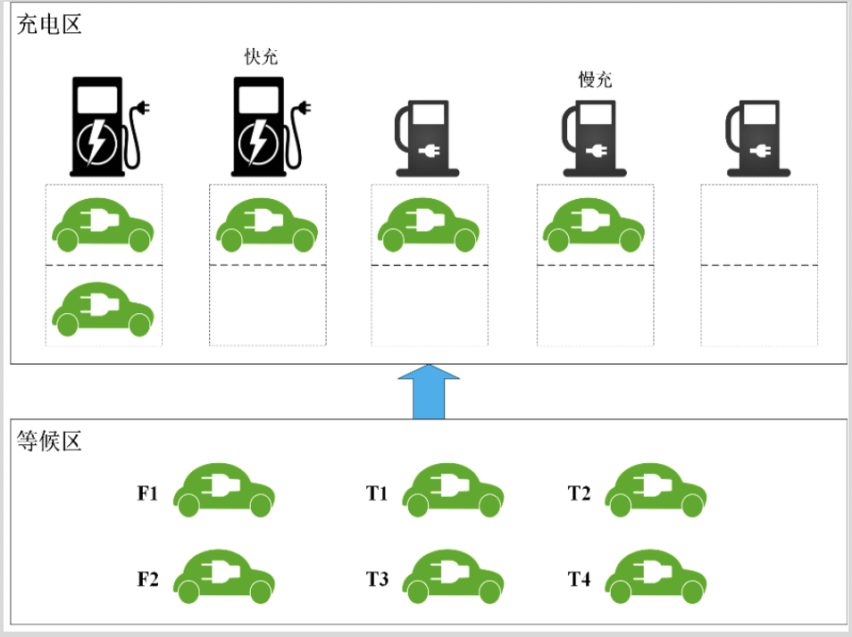

## 题目：智能充电桩调度计费系统
课题基本要求：作为新型交通工具，电动汽车是未来汽车行业的发展趋势。在环境保护日益受到重视的今天，电动汽车越来越多，充电需求日益增大。充电桩作为重要基础设施，其运营管理水平直接影响着波普特大学电动汽车拥有者的使用体验以及车辆停放的管理，为此学校需要在校区设计一套智能充电桩调度计费系统，以便使得电动车完成充电服务的时间（充电时间+排队时间）达到最短的效果。

## 系统需求说明
充电站分为“等候区”和“充电区”两个部分。
假定车辆到达充电站后首先进入等候区，此时可以通过客户端软件发起充电请求（暂时不考虑等候区外的请求），等候区的容量待定（暂时考虑能容纳任意数量车辆）。用户在等候区发起充电请求后，将按照充电模式（快/慢）进入不同的等待队列，此后等待系统叫号进入充电区。
充电区安装有2个快充充电桩+3个慢充充电桩（验收时该数值可变更）。充电区面积有限，每个充电桩后仅设置4个停车位（验收时该数值可变更）供车辆等候充电。当充电区有空余车位时，系统将按照进入等候区的先后顺序从对应充电模式的等待队列中调入车辆，并根据调度策略分配充电桩，并加入对应充电桩的排队队列。 
调度策略：对应充电模式下被调度车辆完成充电所需时间（等待时长+自己充电时长）最短。
计费规则：总费用=充电费+服务费。电价随时间段变化。
系统由服务器端、用户客户端、管理员客户端组成。
充电站配置一名管理员，负责管理、查看充电桩运行状态，并完成报表展示。
用户可能修改充电请求（充电模式/充电电量）甚至取消充电，需要软件设计方设计合理的策略；
充电桩存在出现故障的可能，需要软件设计方设计合理的再调度策略，兼顾公平和效率。

## 示意图
